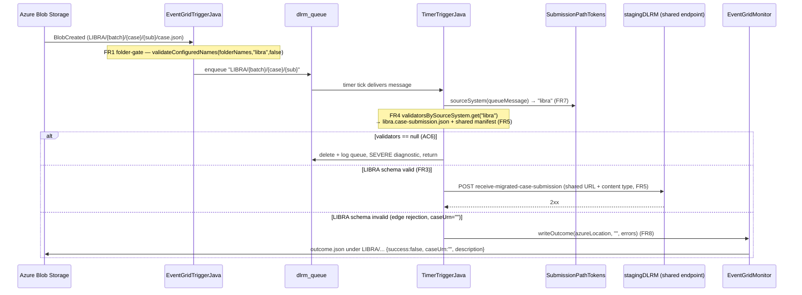

# Design — LIBRA enabler: Function App LIBRA ingest

> Stage 2 artefact (architecture-designer). Source: `01-requirements.md` (approved),
> `00-input-brief.md`.
> No ADR required — this is a scoped extension to one existing standalone component
> (the Azure Functions app in `stagingdlrm-azure-functions`); it adds no bounded context,
> no repo, no command/event/aggregate, and no runtime dependency on the WildFly side.

## Pattern

This is **not** a new-capability / MbD-vs-CQRS-context decision. It is a small extension to
one existing standalone component — the Azure Functions app — inside the existing module
`stagingdlrm-azure-functions`. The epic-level design (one shared stagingDLRM endpoint, one
canonical family, source-system behaviour as pluggable strategy) is already fixed in
`00-input-brief.md`; nothing here re-opens it. So the design below is entirely at the level of
the three function classes and the schema resources they load.

## Scope map (requirement → artefact)

| FR | Production change | Class / file |
|---|---|---|
| FR1 | Folder-name list check, no wildcard | `EventGridTriggerJava` |
| FR7 | Shared source-system derivation | new `event/SubmissionPathTokens` |
| FR3 / FR3a | LIBRA parallel schema chain | 5 new `resources/*.json` |
| FR4 / FR5 | Source-system-keyed validator map, shared manifest validator | new `validator/SourceSystemValidators`, `TimerTriggerJava` |
| FR6 | Drift detection (proposed — needs decision) | new test `FuncAppCanonicalSchemaDriftTest` |
| FR8 | Confirm outcome path is submission-derived | none (tests only) |
| FR2 | EventGrid path filter | out of repo — verify & raise |

Landing order (per `01-requirements.md` "Notes for the design stage" point 1): **FR1 then FR7**
first (small, independent, shrink the diff), then the schema chain FR3, then the selection map
FR4/FR5, then the FR6 guard once its two decisions are confirmed.

All paths below are under
`stagingdlrm-azure-functions/src/main/java/uk/gov/moj/cpp/stagingdlrm/azure/` (production)
and `stagingdlrm-azure-functions/src/main/resources/` (schemas) unless stated otherwise.

---

## FR1 — `dlrm_folder_name` accepts a comma-separated list (no wildcard)

`EventGridTriggerJava` today does two different membership checks two different ways:

- folder name — single exact match, `EventGridTriggerJava:84`
  `folderName.trim().equalsIgnoreCase(tokens.get(0))`
- batch name — comma-split list + `*` wildcard, `EventGridTriggerJava:93-97` and
  `validateBatchNames:119-126`

Collapse both onto **one** private helper, replacing `validateBatchNames`. The only behavioural
difference between the two fields is whether `*` is honoured, so make that a parameter, not a
second copy of the code:

```java
private boolean validateConfiguredNames(final List<String> configuredNames,
                                        final String token,
                                        final boolean wildcardAllowed) {
    if (wildcardAllowed && configuredNames.contains("*")) {
        return true;
    }
    return configuredNames.contains(token);
}
```

Both fields are parsed the same way — comma-split, `trim()`, `toLowerCase()` — matching the
existing batch-name parse at `EventGridTriggerJava:93-95`, and the token compared is
lower-cased the same way:

```java
final List<String> folderNames = Arrays.stream(folderName.split(","))
        .map(s -> s.trim().toLowerCase())
        .toList();

if (!validateConfiguredNames(folderNames, tokens.get(0).toLowerCase(), false)) {   // FR1: wildcard NOT allowed
    loggerHelper.logInfo(context, submissionId, "Received invalid dlrm folder name : {0}", tokens.get(0));
    return;
}
// ...
final List<String> batchNames = Arrays.stream(batchName.split(","))
        .map(s -> s.trim().toLowerCase())
        .toList();

if (!validateConfiguredNames(batchNames, tokens.get(1).toLowerCase(), true)) {     // wildcard allowed, unchanged behaviour
    loggerHelper.logInfo(context, submissionId, "Received invalid dlrm batch name : {0}", tokens.get(1));
    return;
}
```

Notes:
- `wildcardAllowed=false` on the folder gate is what enforces AC2 — `dlrm_folder_name=*` must be
  **rejected**, because the folder name *is* the source-system gate (`00-input-brief.md` "Known
  blockers", `01-requirements.md` FR1). A literal `*` folder is simply not a configured member,
  so it falls through to rejection.
- Deployment config becomes `dlrm_folder_name=XHIBIT,LIBRA` (AC1). No change to the queue message
  format, path parsing, or submission-id extraction — the folder token stays opaque data
  everywhere downstream (NFR1).
- `requireNonNull(folderName, ...)` at `:82` and `requireNonNull(batchName, ...)` at `:91` stay.

---

## FR7 — one shared source-system derivation helper

The source-system token is validated in `EventGridTriggerJava` (`tokens.get(0)`) and
re-extracted, by hand, in `TimerTriggerJava` / `EventGridMonitor`
(`Arrays.stream(azureLocation.split("/"))...get(0)`, e.g.
`TimerTriggerJava.getSplitStr` + `extractMigrationSourceSystemName`,
`TimerTriggerJava:447-453`). Because the schema selection (FR4) must key on the *same* value the
gate checked, extract that logic once.

New stateless utility `event/SubmissionPathTokens.java`:

```java
package uk.gov.moj.cpp.stagingdlrm.azure.event;

import java.util.Arrays;
import java.util.List;

public final class SubmissionPathTokens {

    private SubmissionPathTokens() { }

    public static List<String> split(final String path) {
        return Arrays.stream(path.split("/")).toList();
    }

    /** First path token, lower-cased. No trim — preserves the exact behaviour the gate already relies on. */
    public static String sourceSystem(final String path) {
        return split(path).get(0).toLowerCase();
    }
}
```

- `sourceSystem` lower-cases only (no `trim()`) — the folder gate compares `tokens.get(0)` after
  the container prefix is stripped, and never trimmed it before; keeping that identical avoids a
  silent behaviour change (NFR1). The lower-casing is what makes the value line up with the
  lower-cased map keys in FR4 and the lower-cased folder-name list in FR1.
- `TimerTriggerJava.processQueueMessage` calls `SubmissionPathTokens.sourceSystem(queueMessage)`
  to pick the validator pair (FR4). `EventGridTriggerJava`'s folder gate can also route its split
  through `SubmissionPathTokens.split(...)` so the two sides provably split identically.
- **Depends on FR1 landing first** (`01-requirements.md` "Notes" point 1): FR1 settles how the
  folder token is compared, and FR7 then guarantees FR4 keys on that same token.

New test `SubmissionPathTokensTest` (no prior analogous suite exists — see FR9).

---

## FR3 / FR3a — the LIBRA normalised schema (parallel chain, `caseDetails` depth only)

A **fully independent** parallel schema chain. The XHIBIT files
(`stagingdlrm.case-submission.json`, `migrated-case.json`, `case-details.json`,
`pcf-prosecutor.json`, `stagingdlrm.manifest.json`) are **not modified and not `$ref`-ed** by
the LIBRA files — the two chains never touch. New files under
`stagingdlrm-azure-functions/src/main/resources/`:

| New file | Mirrors | Difference |
|---|---|---|
| `libra.case-submission.json` | `stagingdlrm.case-submission.json` | `$ref` → `libra-migrated-case.json` |
| `libra-migrated-case.json` | `migrated-case.json` | `$ref` → `libra-case-details.json` |
| `libra-case-details.json` | `case-details.json` | the real content — see below |
| `libra-prosecutor.json` | `pcf-prosecutor.json` | adds `required: ["prosecutingAuthority"]` |
| `libra-case-marker.json` | (new — no XHIBIT equivalent) | minimal `{ markerTypeCode: string }` |

The manifest schema is **not** forked — LIBRA reuses `stagingdlrm.manifest.json` (FR5).

### `libra-case-details.json` content — derived from the matrix, not from a copy

Authored from `docs/analysis/libra-ingestion/libra-schema-impact.csv`, filtering the
`funcapp_libra_action` column (do **not** derive by editing a copy of `case-details.json` —
`01-requirements.md` FR3, "Notes" point 3). The `caseDetails`-scoped fields:

| `funcapp_libra_action` | Fields | Effect in `libra-case-details.json` |
|---|---|---|
| `omit` (7) | `dateReceived`, `receiptType`, `receivingCourt`, `retrialIndicator`, `dateOfCommittal`, `dateOfSending`, `sendingCourt` | absent from `properties` entirely (and, with the closed object, rejected if sent) |
| `require` (4) | `initiationCode`, `originatingOrganisation`, `prosecutorCaseReference`, `prosecutor` (`prosecutingAuthority` one level down) | present in `properties` **and** in `required` |
| `declare` (5) | `summonsCode`, `informant`, `writtenChargePostingDate`, `cpsOrganisation`, `caseMarkers[].markerTypeCode` | present in `properties`, **not** in `required` |
| `not-validated-at-gate` (149) | below `caseDetails` (defendants / offences / hearings / officerInCase) | not present — gate stays at `caseDetails` depth (FR3a) |

Why `require` is exactly these four and not more: `funcapp_xhibit_status` in the CSV shows only
four `omit` fields (`dateReceived`, `receiptType`, `receivingCourt`, `retrialIndicator`) are
actually `required` in today's XHIBIT file — a naive copy-paste would wrongly demand those of
LIBRA. LIBRA never supplies them (CSV rows for `dateReceived`/`receiptType`/`receivingCourt`/
`retrialIndicator` = `omit`), so they must be dropped, not carried across. This is exactly
AC3/AC4.

`additionalProperties: false` (closed) is what makes the design work:
- **`declare` becomes load-bearing** — the XHIBIT gate is open (`case-details.json:47`
  `additionalProperties: true`), so on XHIBIT an undeclared field passes; on LIBRA a closed
  object means a field left undeclared is rejected *at the gate*. The five `declare` fields must
  therefore be present-but-optional or a valid LIBRA payload carrying them is a false rejection
  (CSV rows 2/43/44/55/69: `summonsCode`, `informant`, `writtenChargePostingDate`,
  `cpsOrganisation`, `markerTypeCode` — all "declare … the generated caseDetails is closed").
- **`omit` becomes enforced** — a closed object rejects the omitted fields if a payload sends
  them, which is the intended "reject at the edge" behaviour.

**No constraints beyond bare `type`** — no `enum`, no `pattern`, no `maxLength`/`minLength`
(FR3a, FR6). This is deliberate:
- it matches the existing gate's zero-constraint style (the flattened func-app schema at
  `docs/analysis/libra-ingestion/schema/canonical/staging-dlrm-funcapp-flattened.json` carries no
  constraints at all);
- it keeps the func-app schema from becoming a second source of business-rule truth — business
  rules (`initiationCode` enum, oucode lengths, mandatory-per-case-type marks) belong to
  stagingDLRM / canonical under DD-43081 (`01-requirements.md` Out of scope, Risks);
- `initiationCode is not restricted to "O"` is trivially satisfied — the gate carries no enum, so
  LIBRA's `C/J/Q/S` pass; the enum relaxation is canonical-side, DD-43081 (CSV row 49).

Sketch:

```json
{
  "$schema": "http://json-schema.org/draft-04/schema#",
  "id": "libra-case-details.json",
  "type": "object",
  "description": "LIBRA Prosecution Case File Details (Function App gate — structural, presence-only)",
  "properties": {
    "prosecutorCaseReference": { "type": "string" },
    "originatingOrganisation": { "type": "string" },
    "prosecutor":              { "$ref": "libra-prosecutor.json" },
    "initiationCode":          { "type": "string" },
    "summonsCode":             { "type": "string" },
    "informant":               { "type": "string" },
    "writtenChargePostingDate":{ "type": "string" },
    "cpsOrganisation":         { "type": "string" },
    "caseMarkers":             { "type": "array", "items": { "$ref": "libra-case-marker.json" } }
  },
  "required": [
    "prosecutorCaseReference",
    "originatingOrganisation",
    "initiationCode",
    "prosecutor"
  ],
  "additionalProperties": false
}
```

`libra-prosecutor.json` — mirrors `pcf-prosecutor.json`, adds the one `require` item that lives a
level down (CSV row 93, `prosecutor.prosecutingAuthority` = `require`):

```json
{
  "$schema": "http://json-schema.org/draft-04/schema#",
  "id": "libra-prosecutor.json",
  "type": "object",
  "description": "LIBRA Prosecutor Details",
  "properties": {
    "prosecutingAuthority": { "type": "string" }
  },
  "required": ["prosecutingAuthority"],
  "additionalProperties": true
}
```

`libra-case-marker.json` — new; the XHIBIT gate does not validate `caseMarkers` at all, but the
`declare` action needs `caseMarkers[].markerTypeCode` to exist as a valid property so the closed
parent does not reject it (CSV row 55):

```json
{
  "$schema": "http://json-schema.org/draft-04/schema#",
  "id": "libra-case-marker.json",
  "type": "object",
  "description": "LIBRA case marker (structural placeholder — presence only)",
  "properties": {
    "markerTypeCode": { "type": "string" }
  }
}
```

### FR3a — depth decision

Match the **XHIBIT gate's `caseDetails` depth for the first release** (the schema above stops at
`caseDetails`; `defendants` / `hearings` / `officerInCase` are not descended into). Using the
generated deep schema as-is would validate ~113 leaves — 14× XHIBIT's pre-validation strength —
and turn the workbook's blank / `TBC` cells (`observedEthnicity`, `arrestDate`, `hearingType` —
the `review-constraint` rows, CSV rows 54/56/60) into the earliest, least-diagnosable failures in
the chain, while leaving the two source systems with materially different gate strength. Keep the
canonical schema as the deep validator; revisit once a real LIBRA sample exists (`01-requirements.md`
FR3a recommendation).

---

## FR4 / FR5 — source-system-keyed schema selection, shared manifest validator

Today `TimerTriggerJava` holds two single validator fields, hard-wired to the XHIBIT resources:

- `TimerTriggerJava:65-67` — `caseJsonSchemaValidator`, `manifestJsonSchemaValidator`
- `TimerTriggerJava:373-383` — `setJsonSchemaValidator()` loads `stagingdlrm.case-submission.json`
  and `stagingdlrm.manifest.json`

Replace with a table-driven, cache-once map. New record `validator/SourceSystemValidators.java`:

```java
package uk.gov.moj.cpp.stagingdlrm.azure.validator;

public record SourceSystemValidators(JsonSchemaValidator caseValidator,
                                     JsonSchemaValidator manifestValidator) { }
```

In `TimerTriggerJava`, replace the two fields with one map keyed on lower-cased source system:

```java
private Map<String, SourceSystemValidators> validatorsBySourceSystem;

private void setJsonSchemaValidator() {
    if (isNull(validatorsBySourceSystem)) {
        // FR5: ONE shared manifest validator instance, referenced by every entry.
        final JsonSchemaValidator manifest =
                new JsonSchemaValidator(context, "stagingdlrm.manifest.json");

        validatorsBySourceSystem = Map.of(
            "xhibit", new SourceSystemValidators(
                          new JsonSchemaValidator(context, "stagingdlrm.case-submission.json"), manifest),
            "libra",  new SourceSystemValidators(
                          new JsonSchemaValidator(context, "libra.case-submission.json"),        manifest)
        );
    }
}
```

The single `manifest` instance shared across both entries is exactly what keeps FR5 true —
"the manifest schema stays shared" — despite the per-source-system map shape. Only the case
schema varies. The submission URL (`MIGRATED_CASE_SUBMISSION_PATH`, `TimerTriggerJava:39`) and
content type (`stagingDlrmMigratedCaseSubmissionContentType`) are untouched, so routing to the
one shared stagingDLRM endpoint is identical for both systems (FR5, AC5).

Resolve the pair at the top of `processQueueMessage` (`TimerTriggerJava:106`), using FR7:

```java
final String sourceSystem = SubmissionPathTokens.sourceSystem(queueMessage);
final SourceSystemValidators validators = validatorsBySourceSystem.get(sourceSystem);

if (isNull(validators)) {                                                    // AC6
    loggerHelper.logSevere(context, submissionId,
        "No schema configured for source system ''{0}'' — rejecting submission {1}",
        new Object[]{ sourceSystem, queueMessage });
    storageCloudClient.deleteQueueMessage(queueMessage);
    storageCloudClient.sendMessageToTheLogQueue(queueMessage);
    return;
}

final Set<ValidationMessage> caseValidationMessages =
        validators.caseValidator().validate(submissionId, caseJsonContent);
final Set<ValidationMessage> manifestValidationMessages =
        validators.manifestValidator().validate(submissionId, manifestJsonContent);
```

- **AC6 / unconfigured source system** — the `isNull(validators)` branch is mandatory: a clear
  `SEVERE` diagnostic naming the source system, then delete the queue message and route it to the
  log queue (mirroring the existing case/manifest-missing branch at `TimerTriggerJava:123-128`),
  then `return`. **No `NullPointerException`, no silent fallback to XHIBIT's schema.**
  `LoggerHelper` already has a `logSevere(context, submissionId, message)` overload
  (`rest/LoggerHelper.java:41`) — use it directly, no new logging method needed.
- **Adding a third source system is one more map entry** — no new branching anywhere (FR4).
- The lookup key comes from `SubmissionPathTokens.sourceSystem` (FR7), so it is provably the same
  token the FR1 gate already accepted.

---

## FR6 — drift detection (proposed; two decisions needed first)

FR6 is a **proposed mitigation**, not a settled requirement (`00-input-brief.md`,
`01-requirements.md` FR6, "Notes" point 2). Design it as a **JUnit test**, not a build plugin —
matches NFR3 ("build/test-time only") and the module's existing JUnit 5 style, and needs no new
Maven plumbing.

New test `stagingdlrm-azure-functions/src/test/java/uk/gov/moj/cpp/stagingdlrm/azure/validator/FuncAppCanonicalSchemaDriftTest.java`.

It reads the two **already-committed, already-flattened** documents (it does **not** regenerate
them — that stays the manual job of `tools/schema-gen/flatten-canonical-schema.py`):

- `docs/analysis/libra-ingestion/schema/canonical/staging-dlrm-funcapp-flattened.json`
- `docs/analysis/libra-ingestion/schema/canonical/staging-dlrm-canonical-flattened.json`

For every definition name present in **both** files' `definitions` map (intersection today:
`caseDetails`, `migratedCase`, `prosecutor`, `migrationSourceSystem`, `migrationSourceSystemName`),
compare only two things:

1. **`additionalProperties`** — flag if the func-app side is `true`/absent where canonical is
   `false` (the func-app is more lenient — the dangerous direction).
2. **`required`** — for each field in canonical's `required` list that the func-app also declares
   as a property, flag if the func-app does not also require it.

Deliberately scoped to `required` + `additionalProperties` **only**, not full constraint parity
(patterns / lengths / enums). The gate is presence-only by design (FR3a), so a naive full-parity
check reports 100+ findings on day one (`01-requirements.md` FR6, Risks). Only the "more lenient
than canonical for a field both declare" direction is checked — being stricter only causes
earlier, better-diagnosed rejection, which is harmless (Risks).

**Known baseline (why it must be a ratchet, not a zero-tolerance gate).** The XHIBIT func-app
schema is *already* in the lenient state this check detects — `00-input-brief.md` frames FR6 as
drift *detection*, not *elimination* of the pre-existing, already-accepted XHIBIT/canonical drift.
Comparing the two committed flattened files today yields a fixed set of pre-existing findings:

| Definition | Finding |
|---|---|
| `caseDetails` | func-app `additionalProperties: true` vs canonical `false` |
| `migratedCase` | func-app `additionalProperties: true` vs canonical `false` |
| `prosecutor` | func-app `additionalProperties: true` vs canonical `false` |
| `prosecutor` | canonical requires `prosecutingAuthority`; func-app declares it but does not require it |
| `migrationSourceSystem` | canonical requires `migrationSourceSystemName`; func-app declares it but does not require it |
| `migrationSourceSystem` | canonical requires `migrationSourceSystemCaseIdentifier`; func-app declares it but does not require it |

Verified by running the comparison directly against the two committed flattened files (not just reasoned about) —
6 findings today, not 4; the two `migrationSourceSystem` required-field findings are easy to miss by
inspection alone. So implement the test as a **ratchet against a pinned baseline** of exactly these known findings:
fail only on *new* drift beyond the baseline, not on the already-existing condition. (AC8 —
"when a Function App schema is made more lenient than canonical for a shared field, then the build
fails" — is met: a *new* leniency is a finding not in the baseline.)

**Scope: XHIBIT vs canonical only, not LIBRA vs canonical.** Canonical has not yet been relaxed
for LIBRA-specific fields (the `omit`/`require`/`declare` relaxations are DD-43081's job — CSV
`change_type` = `relax-required`/`relax-enum`/`relax-combinator`), so a LIBRA-vs-canonical
comparison at this depth is not meaningful until DD-43081 lands and would produce spurious
findings. The `libra-*.json` chain is therefore out of this check's scope for now; the definition
intersection above naturally excludes the LIBRA-only shapes.

**Two open decisions to confirm with the requester before/during implementation:**

1. **Do FR6 at all, or drop it?** It is explicitly a proposal — the team may prefer to carry the
   risk and keep the schemas fully decoupled with no guard.
2. **If implemented: fail the build, or warn only?** AC8 as written implies fail-the-build; a
   warn-only mode (log the finding, green build) is the lighter alternative. Recommend
   fail-the-build **against the baseline** so only genuinely new drift breaks CI.

---

## FR8 — outcome file path (no production code change; confirm by test)

The outcome path is already submission-derived, not a configured constant. Trace:

- `EventGridMonitorHelper.processEvent(event, azureLocation, fileName)`
  (`EventGridMonitorHelper.java:40-55`) writes to `Path.of(azureLocation + File.separator + fileName)`
  — fully parameterised; nothing source-system-specific is baked in.
- `EventGridMonitor.run` (`EventGridMonitor.java:42-67`) derives everything from the incoming
  event's `azureLocation` via `getSplitStr` / `extractMigrationSourceSystemName`
  (`EventGridMonitor.java:76-82`) — first path token, else the whole `azureLocation`. No
  hardcoded source system. A LIBRA event whose `azureLocation` starts `LIBRA/...` therefore
  writes its outcome under the LIBRA path automatically.
- `TimerTriggerJava.writeOutcome(azureLocation, caseUrn, description)`
  (`TimerTriggerJava:267-294`) uses the same `getSplitStr` / `extractMigrationSourceSystemName`
  and writes both `outcome/outcome-<submissionId>.json` and `outcome.json` under the derived
  location.

For a **Function-App-level rejection** (case never parsed), the caller
`TimerTriggerJava.processClientError(QueueMessage, List<String>, String, String, String)`
(`TimerTriggerJava:242-254`) sets `final String caseUrn = ""` (`:245`) before the chain reaches
`writeOutcome`. The outcome file is still usable: `EventGridMonitorHelper.generateOutcomeContent`
(`EventGridMonitorHelper.java:57-67`) writes `caseUrn` as `String.valueOf(event.get(CASE_URN))`,
so an explicit **empty string** (not null, not a missing key) is what lands — `success: false`,
a populated `description` (the validation error), and `caseUrn: ""` (AC7: "an outcome file appears
under the LIBRA path and its content is asserted whole"). Tests must assert the whole file,
including the empty `caseUrn`.

**No production change for FR8** — this FR is "confirm via tests".

---

## Sequence — a LIBRA blob's path



---

## Out of scope

- **FR2 — EventGrid subscription path filter.** Terraform/ARM outside this repo. If the
  subscription is scoped to `XHIBIT/*`, no LIBRA blob ever triggers the Function App regardless of
  this module's changes. **Verify and raise with the infra owner on day one; record the answer in
  the story.** No design here — it is the single biggest delivery risk (`01-requirements.md` FR2,
  Risks).
- **Canonical schema changes** — the `omit`/`require`/`declare` relaxations, the `initiationCode`
  enum, oucode lengths, the source-system validation-rules strategy, the rejection flow, and the
  field additions all belong to **DD-43081**, not this story (`01-requirements.md` Out of scope).
- Making the Function App depend on `stagingdlrm-domain-value-schema` — explicitly rejected; the
  Function App owns its own normalised schemas.
- `tools/reconciliation/` `--source-system` support — separate ticket.
- Any change to material handling (NFR2 — blob *paths* only, never bytes), the queue message
  format, or batch-size/retry behaviour.

---

## Testing approach (for Stage 4 / Test Specs — informative only)

Per FR9 and `00-input-brief.md`: **extend the existing DD-43078 suites, do not fork them.** Every
LIBRA scenario is added as new scenario / parameterized-test data on the suite that already covers
the equivalent XHIBIT behaviour; XHIBIT scenarios stay green (AC9).

| Existing suite (extend) | New LIBRA scenario data |
|---|---|
| `EventGridTriggerJavaTest` | folder-gate accept for `LIBRA` and `XHIBIT` (AC1); reject unconfigured folder (AC1); `dlrm_folder_name=*` **rejected** — wildcard does not widen the folder gate (AC2) |
| `JsonSchemaValidatorTest` | LIBRA accept/reject rows alongside existing XHIBIT rows — LIBRA payload omitting `receiptType`/`receivingCourt`/`dateReceived`/`retrialIndicator`/`dateOfSending`/`dateOfCommittal` passes LIBRA schema (AC3) and fails XHIBIT schema (AC4) |
| `TimerTriggerJavaTest` | schema-selection routing per source system; same payload POSTed to the same endpoint + content type as XHIBIT (AC5); unconfigured-source-system diagnostic (AC6); edge-rejection outcome file asserted whole incl. `caseUrn:""` (AC7) |

New test classes only where a genuinely new production class has no prior suite to extend:

- `SubmissionPathTokensTest` — the FR7 utility.
- `FuncAppCanonicalSchemaDriftTest` — the FR6 check (baseline ratchet, XHIBIT-vs-canonical scope);
  only if decision (1) above is "implement".
