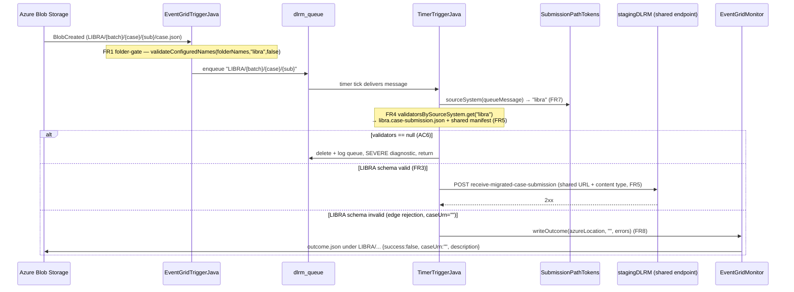

# Design — LIBRA enabler: Function App LIBRA ingest

> Stage 2 artefact (architecture-designer). Source: `01-requirements.md` (approved),
> `00-input-brief.md`.
> No ADR required — this is a scoped extension to one existing standalone component
> (the Azure Functions app in `stagingdlrm-azure-functions`); it adds no bounded context,
> no repo, no command/event/aggregate, and no runtime dependency on the WildFly side.

## Pattern

This is **not** a new-capability / MbD-vs-CQRS-context decision. It is a small extension to
one existing standalone component — the Azure Functions app — inside the existing module
`stagingdlrm-azure-functions`. The epic-level design (one shared stagingDLRM endpoint, one
canonical family, source-system behaviour as pluggable strategy) is already fixed in
`00-input-brief.md`; nothing here re-opens it. So the design below is entirely at the level of
the three function classes and the schema resources they load.

## Scope map (requirement → artefact)

| FR | Production change | Class / file |
|---|---|---|
| FR1 | Folder-name list check, no wildcard | `EventGridTriggerJava` |
| FR7 | Shared source-system derivation | new `event/SubmissionPathTokens` |
| FR3 / FR3a | LIBRA parallel schema chain | 5 new `resources/*.json` |
| FR4 / FR5 | Source-system-keyed validator map, shared manifest validator | new `validator/SourceSystemValidators`, `TimerTriggerJava` |
| FR6 | Drift detection (proposed — needs decision) | new test `FuncAppCanonicalSchemaDriftTest` |
| FR8 | Confirm outcome path is submission-derived | none (tests only) |
| FR2 | EventGrid path filter | out of repo — verify & raise |

Landing order (per `01-requirements.md` "Notes for the design stage" point 1): **FR1 then FR7**
first (small, independent, shrink the diff), then the schema chain FR3, then the selection map
FR4/FR5, then the FR6 guard once its two decisions are confirmed.

All paths below are under
`stagingdlrm-azure-functions/src/main/java/uk/gov/moj/cpp/stagingdlrm/azure/` (production)
and `stagingdlrm-azure-functions/src/main/resources/` (schemas) unless stated otherwise.

---

## FR1 — `dlrm_folder_name` accepts a comma-separated list (no wildcard)

`EventGridTriggerJava` today does two different membership checks two different ways:

- folder name — single exact match, `EventGridTriggerJava:84`
  `folderName.trim().equalsIgnoreCase(tokens.get(0))`
- batch name — comma-split list + `*` wildcard, `EventGridTriggerJava:93-97` and
  `validateBatchNames:119-126`

Collapse both onto **one** private helper, replacing `validateBatchNames`. The only behavioural
difference between the two fields is whether `*` is honoured, so make that a parameter, not a
second copy of the code:

```java
private boolean validateConfiguredNames(final List<String> configuredNames,
                                        final String token,
                                        final boolean wildcardAllowed) {
    if (wildcardAllowed && configuredNames.contains("*")) {
        return true;
    }
    return configuredNames.contains(token);
}
```

Both fields are parsed the same way — comma-split, `trim()`, `toLowerCase()` — matching the
existing batch-name parse at `EventGridTriggerJava:93-95`, and the token compared is
lower-cased the same way:

```java
final List<String> folderNames = Arrays.stream(folderName.split(","))
        .map(s -> s.trim().toLowerCase())
        .toList();

if (!validateConfiguredNames(folderNames, tokens.get(0).toLowerCase(), false)) {   // FR1: wildcard NOT allowed
    loggerHelper.logInfo(context, submissionId, "Received invalid dlrm folder name : {0}", tokens.get(0));
    return;
}
// ...
final List<String> batchNames = Arrays.stream(batchName.split(","))
        .map(s -> s.trim().toLowerCase())
        .toList();

if (!validateConfiguredNames(batchNames, tokens.get(1).toLowerCase(), true)) {     // wildcard allowed, unchanged behaviour
    loggerHelper.logInfo(context, submissionId, "Received invalid dlrm batch name : {0}", tokens.get(1));
    return;
}
```

Notes:
- `wildcardAllowed=false` on the folder gate is what enforces AC2 — `dlrm_folder_name=*` must be
  **rejected**, because the folder name *is* the source-system gate (`00-input-brief.md` "Known
  blockers", `01-requirements.md` FR1). A literal `*` folder is simply not a configured member,
  so it falls through to rejection.
- Deployment config becomes `dlrm_folder_name=XHIBIT,LIBRA` (AC1). No change to the queue message
  format, path parsing, or submission-id extraction — the folder token stays opaque data
  everywhere downstream (NFR1).
- `requireNonNull(folderName, ...)` at `:82` and `requireNonNull(batchName, ...)` at `:91` stay.

---

## FR7 — one shared source-system derivation helper

The source-system token is validated in `EventGridTriggerJava` (`tokens.get(0)`) and
re-extracted, by hand, in `TimerTriggerJava` / `EventGridMonitor`
(`Arrays.stream(azureLocation.split("/"))...get(0)`, e.g.
`TimerTriggerJava.getSplitStr` + `extractMigrationSourceSystemName`,
`TimerTriggerJava:447-453`). Because the schema selection (FR4) must key on the *same* value the
gate checked, extract that logic once.

New stateless utility `event/SubmissionPathTokens.java`:

```java
package uk.gov.moj.cpp.stagingdlrm.azure.event;

import java.util.Arrays;
import java.util.List;

public final class SubmissionPathTokens {

    private SubmissionPathTokens() { }

    public static List<String> split(final String path) {
        return Arrays.stream(path.split("/")).toList();
    }

    /** First path token, lower-cased. No trim — preserves the exact behaviour the gate already relies on. */
    public static String sourceSystem(final String path) {
        return split(path).get(0).toLowerCase();
    }
}
```

- `sourceSystem` lower-cases only (no `trim()`) — the folder gate compares `tokens.get(0)` after
  the container prefix is stripped, and never trimmed it before; keeping that identical avoids a
  silent behaviour change (NFR1). The lower-casing is what makes the value line up with the
  lower-cased map keys in FR4 and the lower-cased folder-name list in FR1.
- `TimerTriggerJava.processQueueMessage` calls `SubmissionPathTokens.sourceSystem(queueMessage)`
  to pick the validator pair (FR4). `EventGridTriggerJava`'s folder gate can also route its split
  through `SubmissionPathTokens.split(...)` so the two sides provably split identically.
- **Depends on FR1 landing first** (`01-requirements.md` "Notes" point 1): FR1 settles how the
  folder token is compared, and FR7 then guarantees FR4 keys on that same token.

New test `SubmissionPathTokensTest` (no prior analogous suite exists — see FR9).

---

## FR3 / FR3a — the LIBRA normalised schema (single, fully self-contained file)

A **fully independent** parallel schema chain. The XHIBIT files
(`stagingdlrm.case-submission.json`, `migrated-case.json`, `case-details.json`,
`pcf-prosecutor.json`, `stagingdlrm.manifest.json`) are **not modified and not `$ref`-ed** by
the LIBRA files — the two chains never touch.

**Final shape, after several rounds of revision during implementation (full history below):**
exactly **one** new file exists under `stagingdlrm-azure-functions/src/main/resources/`:
`libra.case-submission.json`. It mirrors `stagingdlrm.case-submission.json` at the root
(`required: ["migratedCase"]`, closed), but instead of `$ref`-ing out to a `migratedCase` schema
the way the XHIBIT root does, `properties.migratedCase` is a small object with 4 properties, each
itself a local `$ref` to a root-level `definitions` entry: `caseDetails` →
`#/definitions/caseDetails`, `defendants.items` → `#/definitions/defendant`, `hearings.items` →
`#/definitions/hearing`, `officerInCase` → `#/definitions/officerInCase`. `caseDetails` itself
`$ref`s two further entries: `#/definitions/prosecutor` for its `prosecutor` property and
`#/definitions/caseMarkers` for its `caseMarkers.items`. Each `definitions` entry holds the full
content — `caseDetails` (and `prosecutor`/`caseMarkers`, one level further); `defendant` and its
entire nested graph; `hearing` and its entire nested graph; `officerInCase` and its entire nested
graph. No `$ref` to any other **file** remains anywhere in
this schema — all `$ref`s are local, same-document JSON Pointers. `date`, `phone` and `email`
(each reused many times across the graph) are three further `definitions` entries, `$ref`-ed from
wherever they're needed. JSON Pointer `$ref`s resolve against the document root, so `definitions`
lives at the top of the file, one level above `properties.migratedCase`, not nested
inside it.

Every other `libra-*.json` / `libra.*.json` file that existed at earlier points during
implementation (`libra-migrated-case.json`, `libra-case-details.json`, `libra-prosecutor.json`,
`case-marker.json`, `libra-defendant.json`, `libra-address.json`, `libra-individual.json`,
`libra-individual-alias.json`, `libra-offence.json`, `libra-contact-details.json`,
`libra-personal-information.json`, `libra-self-defined-information.json`,
`libra-parent-guardian-person.json`, `libra-parent-guardian-organisation.json`,
`libra-parent-guardian-personal-information.json`, `libra-parent-guardian-address.json`,
`libra-parent-guardian-contact-details.json`, `libra-plea.json`, `libra-verdict.json`,
`libra-allocation-decision.json`, `libra-alcohol-related-offence.json`,
`libra-officer-in-case.json`, `libra-officer-in-case-address.json`, `libra-hearing.json`,
`libra-listed-defendant.json`, `libra-phone.json`, `libra-email.json`, `libra-date.json`) has been
deleted — its content is now inlined in `libra.case-submission.json` (or, for
`date`/`phone`/`email`, moved to that file's root `definitions`).

`migrationSourceSystem.json` (a pre-existing file shared by `stagingdlrm.manifest.json`, the
manifest-file gate) was briefly `$ref`-ed from the LIBRA schema too, then removed entirely — it is
**not** part of `libra.case-submission.json` at all; see "`migrationSourceSystem` is excluded"
below. It remains a separate file because the manifest gate (a different validation target
entirely) still uses it.

The manifest schema is **not** forked — LIBRA reuses `stagingdlrm.manifest.json` (FR5).

### `caseDetails` content — derived from the matrix, not from a copy

Authored from `docs/analysis/libra-ingestion/libra-schema-impact.csv`, filtering the
`funcapp_libra_action` column (do **not** derive by editing a copy of `case-details.json` —
`01-requirements.md` FR3, "Notes" point 3). Originally its own `libra-case-details.json` file,
then inlined into a separate `libra-migrated-case.json`, then inlined directly under
`libra.case-submission.json`'s `properties.migratedCase.properties.caseDetails`, and now factored
out as `libra.case-submission.json`'s own `#/definitions/caseDetails` entry, `$ref`-ed from
`properties.migratedCase.properties.caseDetails` (see "Evolution" below) — the content and
rationale are unchanged throughout, only the file/location boundary has moved. The
`caseDetails`-scoped fields:

| `funcapp_libra_action` | Fields | Effect in `libra-case-details.json` |
|---|---|---|
| `omit` (7) | `dateReceived`, `receiptType`, `receivingCourt`, `retrialIndicator`, `dateOfCommittal`, `dateOfSending`, `sendingCourt` | absent from `properties` entirely (and, with the closed object, rejected if sent) |
| `require` (4) | `initiationCode`, `originatingOrganisation`, `prosecutorCaseReference`, `prosecutor` (`prosecutingAuthority` one level down) | present in `properties` **and** in `required` |
| `declare` (5) | `summonsCode`, `informant`, `writtenChargePostingDate`, `cpsOrganisation`, `caseMarkers[].markerTypeCode` | present in `properties`, **not** in `required` |
| `not-validated-at-gate` (149) | below `caseDetails` (defendants / offences / hearings / officerInCase) | not present — gate stays at `caseDetails` depth (FR3a) |

Why `require` is exactly these four and not more: `funcapp_xhibit_status` in the CSV shows only
four `omit` fields (`dateReceived`, `receiptType`, `receivingCourt`, `retrialIndicator`) are
actually `required` in today's XHIBIT file — a naive copy-paste would wrongly demand those of
LIBRA. LIBRA never supplies them (CSV rows for `dateReceived`/`receiptType`/`receivingCourt`/
`retrialIndicator` = `omit`), so they must be dropped, not carried across. This is exactly
AC3/AC4.

`additionalProperties: false` (closed) is what makes the design work:
- **`declare` becomes load-bearing** — the XHIBIT gate is open (`case-details.json:47`
  `additionalProperties: true`), so on XHIBIT an undeclared field passes; on LIBRA a closed
  object means a field left undeclared is rejected *at the gate*. The five `declare` fields must
  therefore be present-but-optional or a valid LIBRA payload carrying them is a false rejection
  (CSV rows 2/43/44/55/69: `summonsCode`, `informant`, `writtenChargePostingDate`,
  `cpsOrganisation`, `markerTypeCode` — all "declare … the generated caseDetails is closed").
- **`omit` becomes enforced** — a closed object rejects the omitted fields if a payload sends
  them, which is the intended "reject at the edge" behaviour.

**Originally no constraints beyond bare `type`** — no `enum`, no `pattern`, no
`maxLength`/`minLength` (FR3a, FR6). The original rationale:
- it matched the existing gate's zero-constraint style (the flattened func-app schema at
  `docs/analysis/libra-ingestion/schema/canonical/staging-dlrm-funcapp-flattened.json` carries no
  constraints at all);
- it kept the func-app schema from becoming a second source of business-rule truth — business
  rules (`initiationCode` enum, oucode lengths, mandatory-per-case-type marks) belong to
  stagingDLRM / canonical under DD-43081 (`01-requirements.md` Out of scope, Risks);
- `initiationCode is not restricted to "O"` is trivially satisfied — the gate carries no enum, so
  LIBRA's `C/J/Q/S` pass; the enum relaxation is canonical-side, DD-43081 (CSV row 49).

**Revised during implementation:** `maxLength`/`minLength` were added to every `caseDetails`
property, matching the workbook exactly — the same reversal already made for
`defendant`/`hearing`/`officerInCase` (see "Evolution" below), now extended to `caseDetails` too.
`enum`/`pattern` are still absent (`initiationCode`'s enum, `postcode`-style patterns elsewhere
are canonical's job, not this gate's) — only length constraints were added here.

Sketch (as it exists today, at `libra.case-submission.json`'s `definitions.caseDetails` — no
`$schema`/`id` at this nesting level; `properties.migratedCase.properties.caseDetails` is just
`{"$ref": "#/definitions/caseDetails"}`):

```json
{
  "type": "object",
  "properties": {
    "prosecutorCaseReference": { "type": "string", "maxLength": 36 },
    "originatingOrganisation": { "type": "string", "maxLength": 7, "minLength": 7 },
    "prosecutor":              { "$ref": "#/definitions/prosecutor" },
    "initiationCode":          { "type": "string", "maxLength": 1 },
    "cpsOrganisation":         { "type": "string", "maxLength": 7, "minLength": 7 },
    "caseMarkers": { "type": "array", "items": { "$ref": "#/definitions/caseMarkers" } },
    "summonsCode":             { "type": "string", "maxLength": 1 },
    "informant":               { "type": "string", "maxLength": 92 },
    "writtenChargePostingDate":{ "type": "string" }
  },
  "required": [
    "prosecutorCaseReference",
    "originatingOrganisation",
    "initiationCode",
    "prosecutor"
  ],
  "additionalProperties": false
}
```

`prosecutor` — originally mirrored `pcf-prosecutor.json`'s shape (including its
`additionalProperties: true`), adding the one `require` item that lives a level down (CSV row 93,
`prosecutor.prosecutingAuthority` = `require`). Matches the LIBRA workbook schema's own
`prosecutor` definition (`docs/analysis/libra-ingestion/schema/libra/dlrm-libra-0.13.json`, which
also requires `prosecutingAuthority`). Kept LIBRA-only and separate from `pcf-prosecutor.json` — a
deliberate decision made and re-confirmed during implementation (see "Evolution" below) — even
though the two are now both inlined rather than files, so "separate" means "independently
declared", not "separate file". Revised further still: `prosecutor` is now its own root-level
`#/definitions/prosecutor` entry (alongside `caseDetails`/`caseMarkers`/`defendant`/`hearing`/
`officerInCase`/`date`/`phone`/`email`), `$ref`-ed from
`definitions.caseDetails.properties.prosecutor` — used once, factored out for readability rather
than reuse, same rationale as `caseDetails` itself. **Revised once more:**
`additionalProperties` flipped from `true` to `false`, matching the workbook's own `prosecutor`
definition exactly (it declares only `prosecutingAuthority` and closes the object) — the
divergence from `pcf-prosecutor.json` this whole definition already represented is now complete:
same required field, but closed where XHIBIT's stays open.

`caseMarkers[].markerTypeCode` — the XHIBIT gate does not validate `caseMarkers` at all, but the
`declare` action needs `markerTypeCode` to exist as a valid property so the closed parent does not
reject it (CSV row 55). Originally its own `case-marker.json` file (itself renamed once, from
`libra-case-marker.json`, to fix a typo and drop the redundant prefix), then inlined directly under
`caseDetails.properties.caseMarkers.items`, and now factored out as its own root-level
`#/definitions/caseMarkers` entry — the same name the workbook itself uses for this definition —
`$ref`-ed from `definitions.caseDetails.properties.caseMarkers.items`:

```json
{
  "type": "object",
  "properties": {
    "markerTypeCode": { "type": "string", "maxLength": 3 }
  }
}
```

### FR3a — depth decision

**Original decision, for the first release:** match the XHIBIT gate's `caseDetails` depth only —
`defendants`/`hearings`/`officerInCase` not descended into at all. Rationale at the time: using
the generated deep schema as-is would validate ~113 leaves — 14× XHIBIT's pre-validation
strength — and turn the workbook's blank / `TBC` cells (`observedEthnicity`, `arrestDate`,
`hearingType` — the `review-constraint` rows, CSV rows 54/56/60) into the earliest,
least-diagnosable failures in the chain, while leaving the two source systems with materially
different gate strength. This recommendation (`01-requirements.md` FR3a) was **superseded during
implementation** — see "Final state" immediately below — once a real need to validate deeper
emerged; it is kept here as the record of the original reasoning, which still explains why
`caseDetails` itself stops at bare `type` with no constraints.

**Final state, after several rounds of revision during implementation:** all four `migratedCase`
properties are fully expanded to match the LIBRA workbook schema's own definitions, transitively,
all the way down — there is no `migratedCase` branch left bare/undescended, and the whole thing
lives in the single `libra.case-submission.json` file. Each of the four (`caseDetails`,
`defendant`, `hearing`, `officerInCase`) is its own root-level `#/definitions/...` entry, `$ref`-ed
from `properties.migratedCase` — alongside `date`/`phone`/`email`, reused many times across the
graph, as three further `definitions` entries.

- `caseDetails` — matrix-derived (see above), `required`/`additionalProperties` per the matrix.
- `defendants` (`required`) — the workbook's entire `defendant` graph inlined: `address`,
  `individual` (→ `personalInformation`, `selfDefinedInformation`, `parentGuardianInformation`
  → `parentGuardianPerson`/`parentGuardianOrganisation` → their own nested address/contact/personal
  info types), `individualAliases`, `offences` (→ `alcoholRelatedOffence`, `plea`, `verdict`,
  `allocationDecision`).
- `hearings` (declared, optional) — the workbook's `hearing` graph inlined: `listedDefendants`.
- `officerInCase` (declared, optional) — the workbook's `officerInCase` graph inlined: `address`.
- `migrationSourceSystem` is the one workbook `migratedCase` property **not** present at all —
  see below.
- `additionalProperties: false` at the `migratedCase` level — closed, so an undeclared property
  is rejected, but the three declared-optional branches are not.

Unlike `caseDetails` (and the rest of this gate, which stays bare-`type`-only per FR3a/FR6),
**`defendants`/`hearings`/`officerInCase` carry the workbook's full constraints** (`pattern`,
`maxLength`/`minLength`, `minimum`/`maximum`, `minItems`) verbatim — a deliberate, explicitly
scoped reversal of FR3a's "no constraints beyond bare type" principle for these three branches
only (the func-app gate becomes a real business-rule validator here, e.g.
`defendant.address.postcode`'s UK postcode regex, `hearing.courtHearingLocation`'s exact
7-character length). `required`/`additionalProperties` are carried over byte-for-byte from the
workbook per definition — some (e.g. `individual`, `offence`, `personalInformation`) are left open
(no `additionalProperties` key in the workbook) rather than force-closed.

**`migrationSourceSystem` is excluded entirely**, not just left un-required. It was briefly
declared (`$ref`-ed to the pre-existing shared `migrationSourceSystem.json`, already used by
`stagingdlrm.manifest.json`) and required, matching the workbook, then removed. Because
`migratedCase` is closed, this means a payload carrying `migrationSourceSystem` is now
**rejected** as undeclared, not merely optional. `migrationSourceSystem.json` keeps the `required`
extension made while it was briefly referenced — it still independently strengthens the manifest
gate, which is unaffected by this exclusion.

XHIBIT's own `migrated-case.json` is untouched throughout — it still requires only `caseDetails`
and stays open. This is a LIBRA-only strengthening, not a change to a shared/mirrored shape, and
it is the safe direction (stricter, not more lenient — see FR6's own reasoning for why that
direction is harmless).

**Evolution (compressed — each step independently verified against the full test suite before the
next was made):** `caseDetails`-only (matrix-derived) → `defendants`/`migrationSourceSystem`
required alongside it → `migrationSourceSystem` fully removed (closed object now rejects it) →
`defendants` fully recursively expanded with full constraints, as 20 separate `libra-*.json` files
→ `hearings` expanded the same way (2 more files) → `officerInCase` expanded the same way (2 more
files; caught and fixed a live regression in the "declared but optional" test, which had
previously asserted an empty `{}` officerInCase was accepted) → `hearing` inlined back into
`libra-migrated-case.json` (its own file deleted) → `hearing`'s sub-properties
(`listedDefendant`, `dateOfHearing`) inlined too → `caseDetails`/`prosecutor`/`case-marker` and
the entire `defendant`/`officerInCase` graphs inlined the same way, with `date`/`phone`/`email`
(reused 11/12/6 times respectively across the graph) factored out as `libra-migrated-case.json`'s
own local `#/definitions/...` entries rather than duplicated literally or kept as separate files
→ **finally, `libra-migrated-case.json` itself was merged into `libra.case-submission.json`** —
`properties.migratedCase` now holds what used to be the whole of `libra-migrated-case.json`
inline, and the `date`/`phone`/`email` definitions moved from that file's root to
`libra.case-submission.json`'s root (JSON Pointer `$ref`s resolve against the document root, so
they had to move when the two documents became one). No `libra-*.json` file of any kind remains
— `libra.case-submission.json` is the entire LIBRA case-submission schema, one file, root to leaf
→ **`caseDetails` factored out as `#/definitions/caseDetails`**, `$ref`-ed from
`properties.migratedCase.properties.caseDetails` (the same local-definitions treatment as
`date`/`phone`/`email`, even though `caseDetails` is used only once — done for readability/
structure at the top of the file, not deduplication) → **finally, the same treatment for
`defendants`, `hearings` and `officerInCase`**: `defendants.items`/`hearings.items`/
`officerInCase` are each now just a `$ref` to their own root-level `#/definitions/defendant` /
`#/definitions/hearing` / `#/definitions/officerInCase` entry. `properties.migratedCase` is now a
short, readable index of 4 `$ref`s; every leaf property's actual shape lives in `definitions`
alongside `date`/`phone`/`email`. 126/126 tests pass, full reactor
`mvn -pl stagingdlrm-azure-functions -am clean install -DskipITs` succeeds
→ **finally, `maxLength`/`minLength` added to every `caseDetails` property**, matching the
workbook exactly (`prosecutorCaseReference: 36`, `originatingOrganisation`/`cpsOrganisation`/
`prosecutor.prosecutingAuthority: 7`, `initiationCode`/`summonsCode: 1`, `informant: 92`,
`caseMarkers[].markerTypeCode: 3`) — the length-constraint reversal already made for
`defendant`/`hearing`/`officerInCase`, now extended to `caseDetails` too (`enum`/`pattern` are
still absent there). The shared `libra-case-submission-valid.json` fixture's `summonsCode`
(`"SUM001"` → `"A"`), `cpsOrganisation` (`"CPS North West"` → `"CPS0007"`) and
`caseMarkers[0].markerTypeCode` (`"YOUTH"` → `"YOU"`) were updated to satisfy the new lengths.
127/127 tests pass (new: a `caseDetails`-depth constraint-violation test, mirroring the one
already in place for `defendant`/`hearing`), full reactor install succeeds
→ **`prosecutor` factored out as its own `#/definitions/prosecutor` entry**, `$ref`-ed from
`definitions.caseDetails.properties.prosecutor` — same "used once, factored out for readability"
treatment as `caseDetails`/`officerInCase`, extending `definitions` to 7 entries
(`caseDetails`/`prosecutor`/`defendant`/`hearing`/`officerInCase`/`date`/`phone`/`email`).
127/127 tests pass, full reactor install succeeds
→ **`caseMarkers` given the same treatment**, factored out as its own root-level
`#/definitions/caseMarkers` entry (the same name the workbook itself uses), `$ref`-ed from
`definitions.caseDetails.properties.caseMarkers.items` — `definitions` now has 8 entries.
127/127 tests pass, full reactor install succeeds
→ **`prosecutor.additionalProperties` flipped from `true` to `false`**, matching the
workbook's own `prosecutor` definition exactly — the divergence from `pcf-prosecutor.json` is now
complete (same required field, but closed where XHIBIT's stays open). New proving test added
(undeclared `prosecutor` sibling property rejected). 128/128 tests pass, full reactor install
succeeds
→ **`hearing.timeOfHearing` factored out as its own `#/definitions/timeOfHearing`
entry** (`{"type": "string", "minLength": 8, "maxLength": 8, "pattern": "HH:MM:SS"}`), `$ref`-ed
from `definitions.hearing.properties.timeOfHearing` — used once, factored out for readability
same as the rest — `definitions` now has 9 entries. 128/128 tests pass, full reactor install
succeeds
→ **`hearing.listedDefendants.items` factored out as `#/definitions/listedDefendant`**
(singular — the name the workbook itself uses for this definition), `$ref`-ed from
`definitions.hearing.properties.listedDefendants.items` — `definitions` now has 10 entries.
128/128 tests pass, full reactor install succeeds
→ **`defendant.address` factored out as `#/definitions/address`**, `$ref`-ed from
`definitions.defendant.properties.address` — `definitions` now has 11 entries. At this point
`officerInCase.address` was left inline, deliberately — its content happens to be identical to
`defendant.address`, but the workbook treats them as two independently-named definitions
(`address` vs `officerInCaseAddress`), and this whole schema had so far consistently respected the
workbook's own definition boundaries rather than merging coincidentally-identical shapes (same
principle as keeping `prosecutor` separate from `pcf-prosecutor.json`). **This was later
reversed** once the `contactDetails`/`parentGuardianContactDetails` and
`parentGuardianPersonalInformation.address` merges (below) had established that precedent-breaking
was acceptable when explicitly requested — `officerInCase.address` now also `$ref`s
`#/definitions/address` directly (see end of this Evolution log). 128/128 tests pass, full
reactor install succeeds
→ **finally, `postcode` factored out as `#/definitions/postcode`** — a departure from that
principle, and a deliberate one: the workbook has *no* shared `postcode` definition at all (its
UK postcode regex is duplicated inline inside `address`, `officerInCaseAddress` and
`parentGuardianAddress` independently), but this schema's own `address`/`officerInCase.address`/
the deeply-nested `parentGuardianPerson.personalInformation.address` (inside
`defendant.individual.parentGuardianInformation`) all happen to declare it identically. Unlike
`date`/`phone`/`email` (workbook-shared primitives, factored to match the workbook's own
structure), `postcode` here is factored purely to avoid three literal copies of the same 500+
character regex inside one file — a func-app-local deduplication choice, not a workbook mirror.
`definitions` now has 12 entries. 128/128 tests pass, full reactor install succeeds
→ **`defendant.individual` factored out as `#/definitions/individual`**, `$ref`-ed from
`definitions.defendant.properties.individual` — `definitions` now has 13 entries
→ **`individual.personalInformation` factored out as `#/definitions/personalInformation`**,
`$ref`-ed from `definitions.individual.properties.personalInformation` — `definitions` now has 14
entries. Both used once, factored out for readability, same as `caseDetails`/`prosecutor`/
`officerInCase` before them; both are workbook definition names, mirroring workbook structure.
128/128 tests pass, full reactor install succeeds
→ **`personalInformation.contactDetails` and `defendant.individualAliases.items`
factored out** as `#/definitions/contactDetails` and `#/definitions/individualAlias` (singular —
the workbook's own name for the array-item shape), `$ref`-ed from
`definitions.personalInformation.properties.contactDetails` and
`definitions.defendant.properties.individualAliases.items` respectively — `definitions` now has
16 entries. 128/128 tests pass, full reactor install succeeds
→ **finally, `individual.selfDefinedInformation` and `individual.parentGuardianInformation`
factored out** as `#/definitions/selfDefinedInformation` and
`#/definitions/parentGuardianInformation`, `$ref`-ed from
`definitions.individual.properties.selfDefinedInformation`/`.parentGuardianInformation` —
`definitions` now has 18 entries, and `individual` itself is now fully flat (every property
either a bare type or a `$ref`, no nested object literals left). One naming note:
`parentGuardianInformation`'s `oneOf` [person-shape, organisation-shape] is kept as **one**
combined definition here, whereas the workbook (`dlrm-libra-0.13.json`) names the two branches as
separate definitions, `parentGuardianPerson`/`parentGuardianOrganisation` — matching how
`dlrm-0.9.1.json` (the "combined" schema compared earlier) names this same concept, but not
0.13's own split. Not further decomposed since it wasn't asked for; flagging so the naming choice
is traceable if it's ever compared back against 0.13.

→ **the `personalInformation`- and `contactDetails`-shaped objects nested inside
`parentGuardianInformation`'s person branch were factored out too** — but as
`#/definitions/parentGuardianPersonalInformation` and `#/definitions/parentGuardianContactDetails`,
**not** `personalInformation`/`contactDetails` (those names are already taken by `individual`'s
definitions, added earlier, which have a different shape — no `address` property, `maxLength: 255`
not `35`, and include `title`). The workbook itself names these two nested-under-parent-guardian
shapes `parentGuardianPersonalInformation`/`parentGuardianContactDetails` — genuinely distinct
definitions from `personalInformation`/`contactDetails`, not the same one reused. `definitions`
now has 20 entries. 128/128 tests pass, full reactor install succeeds.

→ **`parentGuardianContactDetails` was merged into `contactDetails`** — spotted as
byte-for-byte identical content (both `{work, home, mobile, primaryEmail, secondaryEmail}`, all
`$ref`s to `phone`/`email`, `additionalProperties: false`), true in the workbook too (only
description text differs, already stripped from this schema). Unlike `address`/`officerInCaseAddress`
and `prosecutor`/`pcf-prosecutor.json` — where identical-looking shapes were deliberately kept
separate because the workbook names them separately — this one was **explicitly consolidated on
request**, after confirming with the user this reverses that precedent rather than extends it:
`parentGuardianPersonalInformation.properties.contactDetails` now `$ref`s `#/definitions/contactDetails`
directly, and the standalone `parentGuardianContactDetails` definition was deleted. `definitions`
back down to 19 entries. If the workbook ever diverges the two (e.g. a different phone rule for
parent/guardian contacts), this merge would need to be undone. 128/128 tests pass, full reactor
install succeeds.

→ **the same merge applied to `parentGuardianPersonalInformation.properties.address`**:
byte-for-byte identical to `#/definitions/address` in both this schema and the workbook itself
(only description text differs there too), so it now `$ref`s `#/definitions/address` directly
instead of carrying its own inline copy — no standalone definition existed to delete this time
(it was still inline). `parentGuardianPersonalInformation` is now fully flat (every property
either a bare type or a `$ref`). Same caveat as the `contactDetails` merge: if the workbook ever
diverges `address`/`parentGuardianAddress`, this would need to be undone. 128/128 tests pass, full
reactor install succeeds.

→ **a full-document scan for other duplicate shapes turned up one more genuine
candidate: `officerInCase.properties.address`** — the last remaining copy of the address shape,
flagged back when `defendant.address` was first factored out but left inline at the time (see
above). Confirmed still byte-for-byte identical, and merged the same way, on request:
`officerInCase.properties.address` now `$ref`s `#/definitions/address` directly. The scan's other
hits (e.g. `{"type": "string", "maxLength": 1}` shared by `initiationCode`, `summonsCode`,
`licenseCode`, `custodyStatus`, `vehicleCode`, and others) were **not** treated as merge
candidates — they're coincidental matches between semantically unrelated fields that happen to
share a length limit, not genuine shared concepts, and the workbook never shares them either.
128/128 tests pass, full reactor install succeeds.

→ **`defendant.offences.items` factored out as `#/definitions/offence`** (singular,
matching the workbook's own definition name), `$ref`-ed from
`definitions.defendant.properties.offences.items` — the last top-level `defendant` property left
inline. `offence`'s own nested objects (`alcoholRelatedOffence`, `plea`, `verdict`,
`allocationDecision`) stay inline for now, same staged approach used for `defendant`/`hearing`/
`officerInCase` themselves (factor the container first, decompose further only if asked).
`definitions` now has 20 entries. 128/128 tests pass, full reactor install succeeds

→ **`offence`'s four nested objects factored out too**: `alcoholRelatedOffence`, `plea`,
`verdict`, `allocationDecision` are each now their own root-level `#/definitions/...` entry
(all four workbook definition names, matched exactly), `$ref`-ed from
`definitions.offence.properties.{alcoholRelatedOffence,plea,verdict,allocationDecision}`.
`offence` is now fully flat — every property either a bare type or a `$ref`, no nested object
literals left, matching `individual`/`parentGuardianPersonalInformation`. `definitions` now has
25 entries (the running tally in this log undercounted by one from the `contactDetails` merge
onward — `postcode` was never folded back into the count after that point; the actual file has
always had the extra `postcode` entry). The only inline object literals left anywhere in the schema are
`parentGuardianInformation`'s own two `oneOf` branches — kept inline by design, since that whole
`oneOf` is deliberately one combined definition rather than split into named
`parentGuardianPerson`/`parentGuardianOrganisation` sub-definitions (see above). 128/128 tests
pass, full reactor install succeeds.

→ **finally, an audit of `additionalProperties` across every object-type schema in the file**
(root, `migratedCase`, all 25 `definitions` entries) against the workbook found one genuine gap:
`caseMarkers` was open (`additionalProperties` absent) where the workbook itself closes it
(`false`). Fixed — `definitions.caseMarkers` now has `additionalProperties: false`, with a new
proving test (`shouldRejectLibraCaseSubmissionWithAnUndeclaredCaseMarkerProperty`). The other 6
definitions without `additionalProperties: false` (`offence`, `individual`,
`personalInformation`, `parentGuardianPersonalInformation`, `hearing`, `listedDefendant`) were
checked and left as-is — the workbook itself leaves every one of them open too, so this is
faithful, not an oversight. 129/129 tests pass, full reactor install succeeds.

**Code review pass** (`code-reviewer` agent, against `team/libra1`) — approved with comments, two
of which were fixed:
- `defendant.offences` was missing `minItems: 1` (the workbook has it; the sibling arrays
  `hearing.listedDefendants` and `listedDefendant.listedOffences` already carried it correctly —
  an oversight, not a deliberate choice). Fixed, with a new proving test
  (`shouldRejectLibraCaseSubmissionWithADefendantHavingNoOffences`).
- This log's running `definitions` entry count had undercounted by one from the `contactDetails`
  merge onward (`postcode` was never folded back into the tally) — corrected above; the file
  itself was always correct.
130/130 tests pass, full reactor install succeeds.

→ **`postcode` renamed to `ukGovPostCode`** — `#/definitions/postcode` is now
`#/definitions/ukGovPostCode`, `$ref`-ed from `definitions.address.properties.postcode` (the
JSON property name in payloads, `postcode`, is unchanged — only the internal definition key
changed, to name the concept rather than the field). 130/130 tests pass, full reactor install
succeeds.

→ **`minItems: 1` added to `migratedCase.defendants` and `migratedCase.hearings`** —
unlike the `defendant.offences` fix above, this has **no workbook counterpart**: the workbook
leaves both of these top-level arrays as bare `type: array`, constraining only the nested arrays
(`offences`, `listedDefendants`, `listedOffences`). A deliberate LIBRA-gate strengthening beyond
the workbook, added on request. `defendants` was already `required`, so this closes the
remaining "present but empty" gap; `hearings` is still optional, so the constraint only applies
once the key is sent at all. The shared `libra-case-submission-valid.json` fixture's
`"defendants": []` was replaced with one fully-populated defendant (mirroring the test's
`validDefendant()` builder exactly), and the "declared but optional" test's `hearings` row was
changed from an empty array to one valid hearing (`validHearing()`), since an empty array no
longer passes. Two new proving tests added
(`shouldRejectLibraCaseSubmissionWithNoDefendants`, `shouldRejectLibraCaseSubmissionWithAnEmptyHearingsArray`).
132/132 tests pass, full reactor install succeeds.

**Code review pass 2** (against the `postcode` rename and the `defendants`/`hearings` `minItems`
change above) — approved with comments: all previously-flagged items confirmed fixed, the rename
verified fully clean (no dangling/orphaned `$ref`s), the new `minItems` additions correctly
implemented and workbook-cross-checked. One non-blocking suggestion: the three `minItems`
rejection tests asserted only `messages.size() == 1`, not that the message actually names
`minItems` — addressed below.

→ **finally, `minItems: 1` extended to three more optional arrays**:
`caseDetails.caseMarkers`, `defendant.aliasForCorporate`, `defendant.individualAliases` — same
no-workbook-counterpart, deliberate LIBRA-gate strengthening as `defendants`/`hearings`, on
request. All three are optional at their parent level, so omitting the key entirely remains
valid; only an empty-but-present array is now rejected. New parameterized proving tests
(`shouldRejectLibraCaseSubmissionWithAnEmptyCaseDetailsArray`,
`shouldRejectLibraCaseSubmissionWithAnEmptyDefendantArray`). Also addressed the review's
assertion-tightness suggestion for all five `minItems` tests at once: a shared
`assertRejectedByMinItems(...)` helper now asserts both `messages.size() == 1` and that the
message contains networknt's `"minimum of"` wording, replacing the previous size-only checks.
135/135 tests pass, full reactor install succeeds.

---

## FR4 / FR5 — source-system-keyed schema selection, shared manifest validator

Today `TimerTriggerJava` holds two single validator fields, hard-wired to the XHIBIT resources:

- `TimerTriggerJava:65-67` — `caseJsonSchemaValidator`, `manifestJsonSchemaValidator`
- `TimerTriggerJava:373-383` — `setJsonSchemaValidator()` loads `stagingdlrm.case-submission.json`
  and `stagingdlrm.manifest.json`

Replace with a table-driven, cache-once map. New record `validator/SourceSystemValidators.java`:

```java
package uk.gov.moj.cpp.stagingdlrm.azure.validator;

public record SourceSystemValidators(JsonSchemaValidator caseValidator,
                                     JsonSchemaValidator manifestValidator) { }
```

In `TimerTriggerJava`, replace the two fields with one map keyed on lower-cased source system:

```java
private Map<String, SourceSystemValidators> validatorsBySourceSystem;

private void setJsonSchemaValidator() {
    if (isNull(validatorsBySourceSystem)) {
        // FR5: ONE shared manifest validator instance, referenced by every entry.
        final JsonSchemaValidator manifest =
                new JsonSchemaValidator(context, "stagingdlrm.manifest.json");

        validatorsBySourceSystem = Map.of(
            "xhibit", new SourceSystemValidators(
                          new JsonSchemaValidator(context, "stagingdlrm.case-submission.json"), manifest),
            "libra",  new SourceSystemValidators(
                          new JsonSchemaValidator(context, "libra.case-submission.json"),        manifest)
        );
    }
}
```

The single `manifest` instance shared across both entries is exactly what keeps FR5 true —
"the manifest schema stays shared" — despite the per-source-system map shape. Only the case
schema varies. The submission URL (`MIGRATED_CASE_SUBMISSION_PATH`, `TimerTriggerJava:39`) and
content type (`stagingDlrmMigratedCaseSubmissionContentType`) are untouched, so routing to the
one shared stagingDLRM endpoint is identical for both systems (FR5, AC5).

Resolve the pair at the top of `processQueueMessage` (`TimerTriggerJava:106`), using FR7:

```java
final String sourceSystem = SubmissionPathTokens.sourceSystem(queueMessage);
final SourceSystemValidators validators = validatorsBySourceSystem.get(sourceSystem);

if (isNull(validators)) {                                                    // AC6
    loggerHelper.logSevere(context, submissionId,
        "No schema configured for source system ''{0}'' — rejecting submission {1}",
        new Object[]{ sourceSystem, queueMessage });
    storageCloudClient.deleteQueueMessage(queueMessage);
    storageCloudClient.sendMessageToTheLogQueue(queueMessage);
    return;
}

final Set<ValidationMessage> caseValidationMessages =
        validators.caseValidator().validate(submissionId, caseJsonContent);
final Set<ValidationMessage> manifestValidationMessages =
        validators.manifestValidator().validate(submissionId, manifestJsonContent);
```

- **AC6 / unconfigured source system** — the `isNull(validators)` branch is mandatory: a clear
  `SEVERE` diagnostic naming the source system, then delete the queue message and route it to the
  log queue (mirroring the existing case/manifest-missing branch at `TimerTriggerJava:123-128`),
  then `return`. **No `NullPointerException`, no silent fallback to XHIBIT's schema.**
  `LoggerHelper` already has a `logSevere(context, submissionId, message)` overload
  (`rest/LoggerHelper.java:41`) — use it directly, no new logging method needed.
- **Adding a third source system is one more map entry** — no new branching anywhere (FR4).
- The lookup key comes from `SubmissionPathTokens.sourceSystem` (FR7), so it is provably the same
  token the FR1 gate already accepted.

---

## FR6 — drift detection (proposed; two decisions needed first)

FR6 is a **proposed mitigation**, not a settled requirement (`00-input-brief.md`,
`01-requirements.md` FR6, "Notes" point 2). Design it as a **JUnit test**, not a build plugin —
matches NFR3 ("build/test-time only") and the module's existing JUnit 5 style, and needs no new
Maven plumbing.

New test `stagingdlrm-azure-functions/src/test/java/uk/gov/moj/cpp/stagingdlrm/azure/validator/FuncAppCanonicalSchemaDriftTest.java`.

It reads the two **already-committed, already-flattened** documents (it does **not** regenerate
them — that stays the manual job of `tools/schema-gen/flatten-canonical-schema.py`):

- `docs/analysis/libra-ingestion/schema/canonical/staging-dlrm-funcapp-flattened.json`
- `docs/analysis/libra-ingestion/schema/canonical/staging-dlrm-canonical-flattened.json`

For every definition name present in **both** files' `definitions` map (intersection today:
`caseDetails`, `migratedCase`, `prosecutor`, `migrationSourceSystem`, `migrationSourceSystemName`),
compare only two things:

1. **`additionalProperties`** — flag if the func-app side is `true`/absent where canonical is
   `false` (the func-app is more lenient — the dangerous direction).
2. **`required`** — for each field in canonical's `required` list that the func-app also declares
   as a property, flag if the func-app does not also require it.

Deliberately scoped to `required` + `additionalProperties` **only**, not full constraint parity
(patterns / lengths / enums). The gate is presence-only by design (FR3a), so a naive full-parity
check reports 100+ findings on day one (`01-requirements.md` FR6, Risks). Only the "more lenient
than canonical for a field both declare" direction is checked — being stricter only causes
earlier, better-diagnosed rejection, which is harmless (Risks).

**Known baseline (why it must be a ratchet, not a zero-tolerance gate).** The XHIBIT func-app
schema is *already* in the lenient state this check detects — `00-input-brief.md` frames FR6 as
drift *detection*, not *elimination* of the pre-existing, already-accepted XHIBIT/canonical drift.
Comparing the two committed flattened files today yields a fixed set of pre-existing findings:

| Definition | Finding |
|---|---|
| `caseDetails` | func-app `additionalProperties: true` vs canonical `false` |
| `migratedCase` | func-app `additionalProperties: true` vs canonical `false` |
| `prosecutor` | func-app `additionalProperties: true` vs canonical `false` |
| `prosecutor` | canonical requires `prosecutingAuthority`; func-app declares it but does not require it |
| `migrationSourceSystem` | canonical requires `migrationSourceSystemName`; func-app declares it but does not require it |
| `migrationSourceSystem` | canonical requires `migrationSourceSystemCaseIdentifier`; func-app declares it but does not require it |

Verified by running the comparison directly against the two committed flattened files (not just reasoned about) —
6 findings today, not 4; the two `migrationSourceSystem` required-field findings are easy to miss by
inspection alone. **Stale as of the `migrationSourceSystem.json` change above:** the live resource
file now declares both fields `required`, so these 2 findings would no longer reproduce once
`staging-dlrm-funcapp-flattened.json` is next regenerated (`tools/schema-gen/flatten-canonical-schema.py`)
— baseline would drop to 4. Not corrected here since FR6 is unimplemented and the flattened
snapshot is a manually-regenerated artefact this story does not touch; whoever picks up FR6 should
regenerate first and re-verify the count. So implement the test as a **ratchet against a pinned baseline** of exactly these known findings:
fail only on *new* drift beyond the baseline, not on the already-existing condition. (AC8 —
"when a Function App schema is made more lenient than canonical for a shared field, then the build
fails" — is met: a *new* leniency is a finding not in the baseline.)

**Scope: XHIBIT vs canonical only, not LIBRA vs canonical.** Canonical has not yet been relaxed
for LIBRA-specific fields (the `omit`/`require`/`declare` relaxations are DD-43081's job — CSV
`change_type` = `relax-required`/`relax-enum`/`relax-combinator`), so a LIBRA-vs-canonical
comparison at this depth is not meaningful until DD-43081 lands and would produce spurious
findings. The `libra-*.json` chain is therefore out of this check's scope for now; the definition
intersection above naturally excludes the LIBRA-only shapes.

**Two open decisions to confirm with the requester before/during implementation:**

1. **Do FR6 at all, or drop it?** It is explicitly a proposal — the team may prefer to carry the
   risk and keep the schemas fully decoupled with no guard.
2. **If implemented: fail the build, or warn only?** AC8 as written implies fail-the-build; a
   warn-only mode (log the finding, green build) is the lighter alternative. Recommend
   fail-the-build **against the baseline** so only genuinely new drift breaks CI.

---

## FR8 — outcome file path (no production code change; confirm by test)

The outcome path is already submission-derived, not a configured constant. Trace:

- `EventGridMonitorHelper.processEvent(event, azureLocation, fileName)`
  (`EventGridMonitorHelper.java:40-55`) writes to `Path.of(azureLocation + File.separator + fileName)`
  — fully parameterised; nothing source-system-specific is baked in.
- `EventGridMonitor.run` (`EventGridMonitor.java:42-67`) derives everything from the incoming
  event's `azureLocation` via `getSplitStr` / `extractMigrationSourceSystemName`
  (`EventGridMonitor.java:76-82`) — first path token, else the whole `azureLocation`. No
  hardcoded source system. A LIBRA event whose `azureLocation` starts `LIBRA/...` therefore
  writes its outcome under the LIBRA path automatically.
- `TimerTriggerJava.writeOutcome(azureLocation, caseUrn, description)`
  (`TimerTriggerJava:267-294`) uses the same `getSplitStr` / `extractMigrationSourceSystemName`
  and writes both `outcome/outcome-<submissionId>.json` and `outcome.json` under the derived
  location.

For a **Function-App-level rejection** (case never parsed), the caller
`TimerTriggerJava.processClientError(QueueMessage, List<String>, String, String, String)`
(`TimerTriggerJava:242-254`) sets `final String caseUrn = ""` (`:245`) before the chain reaches
`writeOutcome`. The outcome file is still usable: `EventGridMonitorHelper.generateOutcomeContent`
(`EventGridMonitorHelper.java:57-67`) writes `caseUrn` as `String.valueOf(event.get(CASE_URN))`,
so an explicit **empty string** (not null, not a missing key) is what lands — `success: false`,
a populated `description` (the validation error), and `caseUrn: ""` (AC7: "an outcome file appears
under the LIBRA path and its content is asserted whole"). Tests must assert the whole file,
including the empty `caseUrn`.

**No production change for FR8** — this FR is "confirm via tests".

---

## Sequence — a LIBRA blob's path



---

## Out of scope

- **FR2 — EventGrid subscription path filter.** Terraform/ARM outside this repo. If the
  subscription is scoped to `XHIBIT/*`, no LIBRA blob ever triggers the Function App regardless of
  this module's changes. **Verify and raise with the infra owner on day one; record the answer in
  the story.** No design here — it is the single biggest delivery risk (`01-requirements.md` FR2,
  Risks).
- **Canonical schema changes** — the `omit`/`require`/`declare` relaxations, the `initiationCode`
  enum, oucode lengths, the source-system validation-rules strategy, the rejection flow, and the
  field additions all belong to **DD-43081**, not this story (`01-requirements.md` Out of scope).
- Making the Function App depend on `stagingdlrm-domain-value-schema` — explicitly rejected; the
  Function App owns its own normalised schemas.
- `tools/reconciliation/` `--source-system` support — separate ticket.
- Any change to material handling (NFR2 — blob *paths* only, never bytes), the queue message
  format, or batch-size/retry behaviour.

---

## Testing approach (for Stage 4 / Test Specs — informative only)

Per FR9 and `00-input-brief.md`: **extend the existing DD-43078 suites, do not fork them.** Every
LIBRA scenario is added as new scenario / parameterized-test data on the suite that already covers
the equivalent XHIBIT behaviour; XHIBIT scenarios stay green (AC9).

| Existing suite (extend) | New LIBRA scenario data |
|---|---|
| `EventGridTriggerJavaTest` | folder-gate accept for `LIBRA` and `XHIBIT` (AC1); reject unconfigured folder (AC1); `dlrm_folder_name=*` **rejected** — wildcard does not widen the folder gate (AC2) |
| `JsonSchemaValidatorTest` | LIBRA accept/reject rows alongside existing XHIBIT rows — LIBRA payload omitting `receiptType`/`receivingCourt`/`dateReceived`/`retrialIndicator`/`dateOfSending`/`dateOfCommittal` passes LIBRA schema (AC3) and fails XHIBIT schema (AC4) |
| `TimerTriggerJavaTest` | schema-selection routing per source system; same payload POSTed to the same endpoint + content type as XHIBIT (AC5); unconfigured-source-system diagnostic (AC6); edge-rejection outcome file asserted whole incl. `caseUrn:""` (AC7) |

New test classes only where a genuinely new production class has no prior suite to extend:

- `SubmissionPathTokensTest` — the FR7 utility.
- `FuncAppCanonicalSchemaDriftTest` — the FR6 check (baseline ratchet, XHIBIT-vs-canonical scope);
  only if decision (1) above is "implement".
