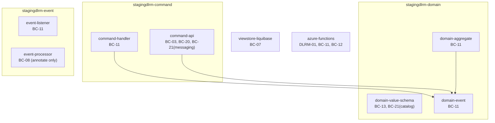

# Design — DD-43192: J17→J25 behavioural-parity tests for stagingDLRM

> Stage 2 artefact (design). Source: [`01-requirements.md`](./01-requirements.md), which itself
> resolves against [`00-input-brief.md`](./00-input-brief.md) and
> [the parity-method ADR](../adrs/DD-43191-j25-parity-method.md).
>
> **This design document is written against a completed implementation**, not ahead of one:
> `team/25.104.x` ← `DD-43192-j25-parity-tests` (PR [#51](https://github.com/hmcts/cpp-context-stagingdlrm/pull/51)).
> Every decision below is the decision actually taken, cross-checked against the delivered test
> classes and a green J17 run recorded in [`docs/j25-parity-checklist.md`](../../j25-parity-checklist.md) —
> this is a record of what was built and why, produced retrospectively for pipeline traceability, not
> a forward-looking proposal. Where the requirements document left an open question for "the design
> stage" (its own closing section), that question is answered here with the resolution that shipped.

## Design summary

Nine Bucket A items, no persistence layer to bind tests to, two genuinely novel primary items
(BC-13, DLRM-01) with no reference implementation anywhere in the fleet, and a hard constraint that
nothing under `src/main` may change (FR18/AC9). The design that emerged from that shape is:

- **One dedicated JUnit test class (or small pair) per item**, each self-labelled with its BC/DLRM
  identifier in a class-level Javadoc block — never a shared "parity suite" class, because FR2 makes
  the label-per-test a first-class requirement and a shared class would blur which assertion pins
  which seam.
- **A single instrument family — plain JUnit 5 tests — for every item**, including the four
  build-time-assertion-tier items (BC-11, BC-12, BC-21, BC-07), rather than reaching for
  `maven-enforcer-plugin` or a shell script for any of them. See "Instrument choice" below.
- **Every assertion is grounded in an actually-executed J17 run**, not the investigation report's
  guessed values — three of the nine items diverged from what a literal reading of the requirements
  or the report would have produced, and the design changed to match what was observed each time
  (numeric-literal outcomes, BC-11's provider-resolution mechanism, and — caught at code review, not
  before — BC-20's target). This is decision 4 of the parity-method ADR applied as an engineering
  practice, not just a documentation rule.
- **New test infrastructure only where a module had none**, added as narrowly as each module needed
  it (`domain-value-schema`, `domain-event`, `viewstore-liquibase` had zero `src/test` before this
  story), never widened beyond what the new tests actually use.

## BC-13 — schema-catalogue tier (`stagingdlrm-domain-value-schema`)

**Where the table lives.** `stagingdlrm-domain-value-schema` had zero Java on this branch (decision 7
of the parity-method ADR) — no `SchemaMatchers`, no `MigratedCaseSubmissionSchemaContractTest`, no
test source root at all. The design does not resurrect those names or shapes; it builds a new,
self-contained test package (`uk.gov.moj.cpp.stagingdlrm.schema`) with two classes:

- `MigratedCaseSubmissionSchemaParityTest` — the parity assertions.
- `ClasspathSchemaClient` (package-private) — schema `$ref` resolution support.

**The `$ref`-resolution problem, and why it needed a custom `SchemaClient`.**
`migrated-case-submission.json` is not self-contained — it `$ref`s out to ~15 other schema files
across `migrated/` and the parent `schema/` directory, plus `common-core-domain`'s `definitions.json`,
using absolute `http://cpp.moj.gov.uk/...` / `http://justice.gov.uk/...` ids. Every existing
everit-usage precedent found in this codebase's dependency tree (`common-core-domain`'s
`CommonSchemaTest`, `criminal-court-public-model`'s equivalent) sidesteps `$ref` resolution entirely
by flattening a schema's `definitions` block into `properties` before loading. That trick doesn't
work here — the refs are genuinely external files, some living in a different Maven module's jar
entirely. Everit's `SchemaLoader.builder()` needs a `SchemaClient` to fetch anything it can't resolve
locally, and the design deliberately does **not** hand-maintain an id→classpath-path table for it.

Instead, `ClasspathSchemaClient` calls `ClassLoader.getResources("META-INF/schema_catalog.json")` —
plural, enumerating every matching resource on the classpath, not just the first — and merges every
catalogue it finds into one `id → (baseLocation + location)` map. This works because
`catalog-generation-plugin` (the same plugin BC-21 also pins) already produces exactly this catalogue
for **every** module that runs it, including `common-core-domain`, and packages it into
`META-INF/schema_catalog.json` inside each module's own jar. Two catalogues are on this module's test
classpath at once — its own (verified: 30 schema entries, matching `find .../json/schema -name
'*.json' | wc -l`) and `common-core-domain`'s (4 entries, including the `definitions.json` id this
schema tree needs) — and `getResources()` returns both. The result: zero hard-coded paths, and the
resolver keeps working if a schema file is renamed, moved between `json/schema/` and
`json/schema/migrated/`, or gains a new `$ref`, because it reads the same catalogue the framework's
own runtime validator would read, not a parallel guess at one.

One API detail the design had to get right by inspecting the actual everit 1.6.0 jar rather than its
Javadoc summary: `SchemaLoader.SchemaLoaderBuilder` exposes `httpClient(SchemaClient)`, not
`schemaClient(...)` — the method name that would read more naturally for what it does. Confirmed via
`javap` against the real 1.6.0 class file before writing the loader wiring, not assumed from the
interface name `SchemaClient`.

**Numeric-literal table — target field and why.** The table substitutes each of the seven literals
into `migratedCase.hearings[0].durationMinutes` (`migrated-hearing.json`:
`{"type": "integer", "maximum": 99999}`) — a required field on a required-but-otherwise-minimal
`hearings` array, chosen because it is the one schema-validated integer field in the reachable schema
tree that already carries a `maximum` bound, giving the table both a type check and a bound check to
exercise with the same target. The outcomes (`0`/`007`/`01` accepted as `Integer`; `.5`/`10.0`/`1e3`
rejected as `BigDecimal`; `12345678901234567890` rejected as `BigInteger`, on `type`, before `maximum`
is even reached) were obtained by literally running the seven literals through
`org.json.JSONTokener`/`JSONObject` and `everit.Schema.validate()` at J17 with `org.json:20231013` and
`everit:1.6.0` — the exact pinned coordinates — not by reasoning about what org.json *should* do.

**Constraint-class and parse/validation-distinction design.** FR5.2's five constraint classes
(type, enum, required, format, `anyOf`) each get one reject-path test against a single mutation of one
shared valid fixture, plus one accept-path test on the unmutated fixture — a "one field changes,
everything else holds" design chosen so a failing test's diff against the fixture is immediately the
mutation under test, not noise from unrelated fields. The `anyOf` and `required` cases both land on
`case-details.json`, which everit represents internally as a combined (`allOf`-like) schema because it
mixes plain `required` keywords with an `anyOf` block (`dateOfCommittal` XOR-ish `dateOfSending`) — so
their `ValidationException.getMessage()` is a generic "only 1 subschema matches out of 2" wrapper, and
the design asserts on `getAllMessages()` (which flattens the nested causing exceptions) instead, to
reach the actual per-branch required-key messages. FR5.3's parse/validation distinction is two
minimal, deliberately separate tests rather than one parameterised one: `{ "migratedCase": ` (truncated,
a genuine `org.json.JSONException` before any `Schema.validate()` call is reachable) versus `{}`
(syntactically complete, fails on four missing top-level required properties) — chosen because the two
failure classes are asserted through entirely different call sites (`new JSONObject(...)` throwing vs.
`schema.validate(...)` throwing), and collapsing them into one parameterised test would hide that
structural difference.

## DLRM-01 — Function App gate (`stagingdlrm-azure-functions`)

**One test class, not two (requirements' design-stage note 2, resolved).** `JsonSchemaValidator` takes
an `ExecutionContext` but nothing else that can't be constructed directly in a unit test — no
`TimerTriggerJava`-level indirection is needed to observe `readTree` parse outcomes, because
`TimerTriggerJava` never touches the parsed content itself; it hands the raw payload string straight
to `JsonSchemaValidator.validate(...)` and only branches on the returned `Set<ValidationMessage>` /
propagated exception. So FR6 is pinned entirely inside the module's existing `JsonSchemaValidatorTest`,
extended rather than duplicated into a second class, using the same `@Mock ExecutionContext` /
`@BeforeEach` construction pattern the four pre-existing tests in that file already established.

**A separate table, on a different field, for a structural reason (FR7).** The func-app's own copy of
the schema tree (`stagingdlrm-azure-functions/src/main/resources/*.json`) is materially simpler than
`domain-value-schema`'s: `migrated-case.json` here declares only `caseDetails` as required and sets
`"additionalProperties": true`, so `hearings`/`defendants`/`migrationSourceSystem` are accepted
without any type checking at all — `durationMinutes` and `courtRoomId` sit in the existing
`validatePayloadSuccessfully` fixture but are never schema-validated at this tier. The design therefore
targets `manifest.files[0].documentType` (`stagingdlrm.manifest.json`: `"type": "integer"`, **no**
`maximum`) instead — the one integer-typed, actually-validated field this tier's schemas expose. The
missing `maximum` is itself a deliberate, verified choice: it produces a genuinely different outcome
for the oversized-integer literal than BC-13's table gets, which is the point of FR7 existing at all
(see the divergence table below).

**Observed divergence between the two tables**, both executed at J17, same seven literals:

| Literal | BC-13 (org.json 20231013 + everit 1.6.0, `maximum: 99999`) | DLRM-01 (Jackson 2.12.7 + networknt 1.0.83, no `maximum`) |
|---|---|---|
| `0` | ACCEPT (`Integer`) | ACCEPT (`IntNode`) |
| `007` | ACCEPT (`Integer`, leading zero silently dropped) | **PARSE FAILURE** (`JsonParseException`: leading zeroes not allowed) |
| `01` | ACCEPT (`Integer`) | **PARSE FAILURE** |
| `.5` | REJECT (`BigDecimal`, not `Integer`) | **PARSE FAILURE** (unexpected character `.`) |
| `10.0` | REJECT (`BigDecimal`) | REJECT (`DoubleNode`, "number found, integer expected") |
| `1e3` | REJECT (`BigDecimal`) | REJECT (`DoubleNode`) |
| `12345678901234567890` | REJECT (`BigInteger`, fails `type` before `maximum` is reached) | **ACCEPT** (`BigIntegerNode` — no `maximum` configured, so a `BigInteger` satisfies `"type": "integer"` outright) |

Three of seven literals produce a different verdict at the two tiers on the *same* J17 stack, which is
the concrete evidence behind decision 6 of the parity-method ADR: a shared table would have hidden
which library's upgrade exposure actually matters for which outcome.

**Malformed JSON, array rejection, duplicate keys — design choices.** All three are new tests appended
to the existing `JsonSchemaValidatorTest`, sharing its established `@Mock ExecutionContext` fixture.
Two required a fix to that fixture as part of this design: none of the four pre-existing tests ever
reached `JsonSchemaValidator`'s `catch`/reject branches, so `context.getLogger()` had never been
stubbed and returned Mockito's `null` default — the array-rejection and malformed-JSON tests both
call `LoggerHelper.logSevere(context, ...)` on that path, which NPEs before the intended
`RuntimeException` is ever thrown. The fix, `lenient().when(context.getLogger())...` returning a real
`java.util.logging.Logger` (matching `TimerTriggerJavaTest`'s existing idiom elsewhere in the module),
is `lenient()` specifically because the other eleven tests in the class never reach that code path and
Mockito's strict-stubs checker would otherwise flag it as unused per-test. Duplicate-key resolution is
asserted two ways in the same test — via the validator's public pass/fail outcome, and via a second,
independent `new ObjectMapper().readTree(...)` call in the test itself to observe *which* value
Jackson's default `JsonNodeFactory` kept — because the validator's own API only reports schema
conformance, not which duplicate value won, and FR6 wants the latter pinned explicitly, not inferred
from the former.

## BC-11 — JSON-P provider resolution (5 modules)

**The design changed shape once, based on what J17 actually does.** The first draft asserted a
`ServiceLoader.load(JsonProvider.class)` count of one and the resolved provider's identity via
`JsonProvider.provider()`. Running it revealed `ServiceLoader` itself finds **zero** entries on every
affected module's classpath — neither `org.glassfish:javax.json` (1.0.2 in `azure-functions`, 1.1.4
elsewhere) nor `javax.json:javax.json-api:1.0` carries a working
`META-INF/services/javax.json.spi.JsonProvider` registration — while `JsonProvider.provider()` still
resolves successfully, via its internal hard-coded-default-class-name fallback to
`org.glassfish.json.JsonProviderImpl`. AC5 calls the count "the load-bearing assertion", and a count of
zero via `ServiceLoader` is not a usable pin (it would pass identically whether the fallback resolves
one provider or fails entirely). The design that shipped instead counts classpath **resources**
directly — `ClassLoader.getResources("org/glassfish/json/JsonProviderImpl.class")` (pinned at exactly
one) and `ClassLoader.getResources("META-INF/services/javax.json.spi.JsonProvider")` (pinned at exactly
zero, documenting the fallback mechanism itself) — alongside the identity check. This is the count
AC5 asks for; it was just a different count than a first reading of FR8 suggests, and only running the
real J17 classpath surfaced that.

**Same test shape, five different classpaths, five different Javadoc claims.** The three-test class
(`exactlyOneJsonProviderImplementationClassIsOnTheClasspath`,
`noServiceLoaderRegistrationExistsForJsonProviderYet`,
`jsonProviderResolvesToTheSingleGlassfishImplementation`) is identical in all five modules, because
per-module classpath assertions genuinely can't be shared without a test-jar and the assertions
themselves don't vary. What does vary, and is deliberately kept accurate per module rather than
copy-pasted, is the class-level Javadoc: `azure-functions` carries `org.glassfish:javax.json:1.0.2` at
**compile** scope (the only module where the JSON-P RI ships in the deployed artifact);
`command-handler`, `event-listener` and `domain-aggregate` each declare it directly at **test** scope,
unversioned, resolving to `1.1.4` via the BOM; `domain-event` does not declare it at all — its
`org.glassfish:javax.json:1.1.4` only reaches its test classpath transitively via
`uk.gov.justice.services:test-utils-core`, the dependency this story itself added to give that
previously test-free module a JUnit runtime. That last case is called out explicitly in its own
Javadoc rather than presented as a pre-existing exposure, because it wouldn't exist without this PR.

## BC-03 / BC-20 — access control (`stagingdlrm-command-api`)

**BC-03: extend the existing pattern, don't reinvent it.** `AccessControlTest` already had
`shouldOnlyAllowSystemUser`/`shouldNotAllowSystemUser` for
`stagingdlrm.receive-migrated-case-submission`. The design adds two more methods, same class, same
`Map<String,String>`-building style, targeting `stagingdlrm.receive-error-migrated-case-submission` —
the DRL's second rule, which had never been exercised on any JDK. Extending in place rather than a new
class was the deliberate choice: the two rules live in the same `.drl` file and are tested via the
same `BaseDroolsAccessControlTest` harness instance, so splitting them into separate test classes would
duplicate the `getProviderMocks()`/`createActionFor()` wiring for no isolation benefit.

**BC-20: the design that shipped is not the design that was first written, and that's recorded here
deliberately.** The first version constructed its own, independent `KieContainer` via
`KieServices.get().getKieClasspathContainer()` and summed rule counts across
`getKieBaseNames()` — correctly implementing the investigation report's own corrected recommendation
(sum across all kbases, don't guess the kbase name from the ksession name), but interrogating a
container this test built itself rather than the one `AccessControlTest`'s harness actually uses. A
code-review pass caught that a container built independently for the sole purpose of counting its
rules would keep reporting "non-zero" even if the harness's own `setup()` — the thing BC-20 exists to
guard — started silently loading zero rules through a different code path. The design was corrected to
extend `BaseDroolsAccessControlTest` directly and read `kSession.getKieBase().getKiePackages()` — the
protected field every other test in the package already depends on — and to assert the exact
`{"Command - Rule for Migrate Case Submission", "Command - Rule for Error Migrate Case Submission"}`
name set rather than a bare `> 0`, since the real classpath was confirmed (via the same corrected test)
to carry exactly those two rules and nothing else. This sequence — build it, run it, have it reviewed,
find the design doesn't test what it claims to, fix the actual seam being interrogated — is left in
this document rather than smoothed over, because it is itself evidence of decision 4's "run outranks
assumption" principle operating one level up, at design-review time rather than at literal-value time.

## BC-12 — RESTEasy packaging (`stagingdlrm-azure-functions`)

A single test (`BC12RestEasyPackagingParityTest`) parses the module's own `pom.xml` with
`javax.xml.parsers.DocumentBuilderFactory` (with `disallow-doctype-decl` set — an XXE mitigation added
even though the parsed input is the project's own trusted file, because an XML parser without it is a
static-analysis-flagged vulnerability regardless of input trust) and asserts: exactly four
`org.jboss.resteasy` dependencies, matching the fleet's four named artifacts, and no `<scope>` element
on any of them (i.e. compile-scope, the default). Version is deliberately **not** pinned: the
Jakarta-REST swap the upgrade-mechanics ADR's decision 5 describes will legitimately move
`4.3.0.Final`, and asserting it here would make this test fail for that expected reason instead of the
packaging regression (scope, or the fleet-wide `provided` + `packagingExcludes` fix landing somewhere
it shouldn't) it exists to catch.

## BC-21 — codegen contract (2 of 4 generator families)

**Instrument: a contract assertion against the generator's own output, never a literal manifest.**
Both of the two instrumented generator families follow the same shape: count something derivable from
source (schema files on disk; RAML media types) and assert it equals a count derived from the
generator's actual output, rather than hard-coding either count or the generated type names
themselves. `SchemaCatalogGenerationParityTest` (`stagingdlrm-domain-value-schema`) counts `*.json`
files under `src/main/resources/json/schema` (30, confirmed) against entries in the generated
`target/generated-resources/META-INF/schema_catalog.json` — the same catalogue BC-13's
`ClasspathSchemaClient` consumes, so this test also functions as a build-time guarantee that catalogue
exists and is non-trivial before BC-13 depends on it at test-time. `Bc21MessagingClientGenerationParityTest`
(`stagingdlrm-command-api`) counts `application/vnd...+json:` media-type declarations in
`stagingdlrm-command-handler.messaging.raml` (4, confirmed) against `@Handles`-annotated methods on the
generated `RemoteCommandApi2CommandHandlerMessageStagingdlrmStagingdlrmHandlerCommand` class, read via
reflection once the module has compiled.

**Two families deliberately left uninstrumented, and why that's a recorded decision, not an
omission.** `pojo-generation-plugin`'s `pojo-generation-schema` execution in `stagingdlrm-domain-event`
scans the entire test **classpath** (`sourceDirectory: CLASSPATH`), not just this repo's own schema
directory — an observed 536 generated types under `uk/gov/justice/core/courts/**`, driven entirely by
`common-core-domain` and `criminal-court-public-model`, jars this repo doesn't own and whose own
schema counts can change independently of any commit here. A count-based contract test against that
scan would be exactly the "maintenance burden" the requirements' own risk notes warn against, and would
fail for reasons having nothing to do with this repo. `rest-client-generator-plugin` (in
`stagingdlrm-event-processor`) needs `pcfdlrm-command-api` and `progression-query-api`
RAML-classified artifacts that this development environment has never downloaded and cannot fetch
offline — confirmed as a pre-existing condition (via `git stash -u` against a clean branch checkout),
not something this story introduced. Both are recorded as explicit 🟡 rows in the checklist rather than
silently absent from it.

## BC-07 — Liquibase properties (`stagingdlrm-viewstore-liquibase`)

The simplest item: `LiquibasePropertiesParityTest` loads `liquibase.properties` as a
`java.util.Properties` from the classpath and asserts `stringPropertyNames()` equals the exact
three-key set (`changelogFile`, `liquibase.hub.mode`, `liquibase.headless`), plus their literal values.
No design decision beyond "this module had zero test infrastructure, so add the minimum needed" — a
single `uk.gov.justice.services:test-utils-core` test dependency for JUnit 5, matching the same
addition made to `stagingdlrm-domain-event` for the same reason.

## BC-08 — annotate, don't author (`stagingdlrm-event-processor`)

No new test class. FR14 is explicit that authoring a parity test around a test helper
(`ObjectBuilder.buildMetaData`'s `ZonedDateTime.now()` call) would assert the fixture, not the product
— there is no `ZonedDateTime` anywhere in this repo's `src/main`. The design instead adds a Javadoc
block directly above `buildMetaData`, naming BC-08 and FR14 explicitly and pointing at the existing
`StagingDlrmEventProcessorTest` methods that already exercise it, so the 📝 marker in the checklist
has a concrete in-code anchor rather than only a documentation-side claim.

## Instrument choice for FR8 / FR11 / FR12 / FR13 (BC-11, BC-12, BC-21, BC-07)

The requirements' own design-stage note 3 asks for one instrument across these four "build-time fact"
items rather than four different ones (a unit test, a `maven-enforcer` rule, and a script were all
named as viable). The design picked **plain JUnit 5 tests** for all four, uniformly:

- They run in `mvn test`, in the same phase and the same reporting surface as every other parity test
  in this story, so a CI failure in any of the nine items looks identical to a developer — no separate
  enforcer-rule output format or script exit code to learn.
- Every one of the four needs to read something already on the classpath or in the working directory
  at test time (a `pom.xml`, a generated catalogue, a properties file, a classpath resource) — nothing
  here needs Maven's own model resolution machinery (which `maven-enforcer-plugin` would give access
  to more directly), so the extra plugin dependency doesn't buy anything a `DocumentBuilder`/`Properties`/
  `ClassLoader` call in a `@Test` method doesn't already provide.
- A script would run outside JUnit's reporting entirely, becoming invisible to `mvn test -Dtest=...`
  and to the `Tests run: N, Failures: 0` evidence this story's checklist depends on for every 🟢 row.

## Traceability

| BC/DLRM item | Requirement | Test class(es) | Module |
|---|---|---|---|
| BC-13 | FR5, FR2, FR4 | `MigratedCaseSubmissionSchemaParityTest`, `ClasspathSchemaClient` | `stagingdlrm-domain-value-schema` |
| DLRM-01 | FR6, FR7 | `JsonSchemaValidatorTest` (additions) | `stagingdlrm-azure-functions` |
| BC-11 | FR8 | `Bc11JsonProviderParityTest` (×5) | `domain-event`, `domain-aggregate`, `command-handler`, `event-listener`, `azure-functions` |
| BC-03 | FR9 | `AccessControlTest` (additions) | `stagingdlrm-command-api` |
| BC-20 | FR10 | `Bc20RuleHarnessParityTest` | `stagingdlrm-command-api` |
| BC-12 | FR11 | `BC12RestEasyPackagingParityTest` | `stagingdlrm-azure-functions` |
| BC-21 | FR12 | `SchemaCatalogGenerationParityTest`, `Bc21MessagingClientGenerationParityTest` | `domain-value-schema`, `command-api` |
| BC-07 | FR13 | `LiquibasePropertiesParityTest` | `stagingdlrm-viewstore-liquibase` |
| BC-08 | FR14 | (annotation only) | `stagingdlrm-event-processor` |
| — | FR17 | `docs/j25-parity-checklist.md` | (documentation) |

## What this design deliberately does not do

- Does not touch `src/main` anywhere, and does not bump any pom version (FR18/AC9) — verified by
  `git diff` scoping, not just by intent.
- Does not extend `SchemaMatchers` or reference `MigratedCaseSubmissionSchemaContractTest` — per
  decision 7, neither exists on this branch, and inventing them would point a future reader at
  LIBRA-era conventions this branch doesn't carry.
- Does not attempt BC-13/DLRM-01 source-system keying (both `LIBRA` and `XHIBIT` fixtures appear, but
  no test asserts different behaviour *because of* source system) — decision 7 confirms the gate isn't
  keyed by source system on this branch, so a keying-aware test would assert a distinction the code
  doesn't make.
- Does not fix the one live defect this story's exploration surfaced in passing (see the checklist's
  Bucket B row for BC-14/15/16/17 and Gaps section) — FR15 is explicit that a parity story records and
  raises, it does not fix.
